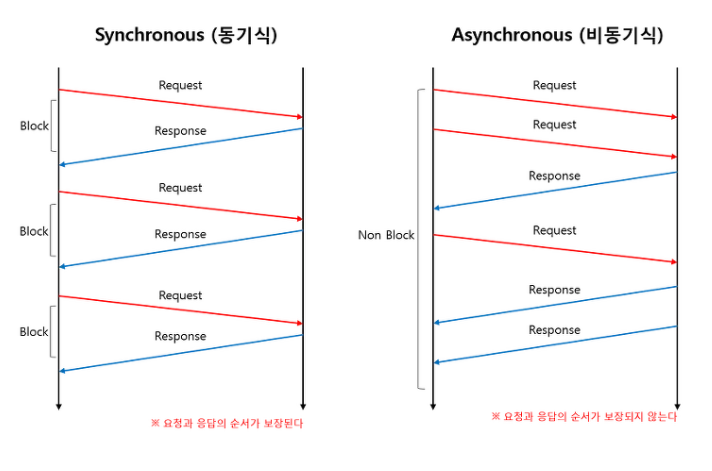

# Dart 언어 마스터 하기
## 1. Dart 입문하기
### 1.1. Dart 소개
- UI를 제작하는데 최적화 됨
- 완전한 비동기 언어
- 이벤트 기반 언어
- 아이솔레이트를 이용한 동시성 기능도 제공함.
- Null Safety, 스프레드 기능, 컬렉션의 IF문 등 효율적으로  UI를 코딩할 수 있는 기능 제공
- Hot Reload를 통해 코드 변경을 즉시 화면에 반영 할 수 있음.
- 멀티 플랫폼에서 로깅, 디버깅 할 수 있음.
- AOT 컴파일 가능하기 때문에 어떤 플랫폼에서든 속도가 빠름
    - 개발할때는 JIT, 배포할때는 AOT
- 자바스크립트로 컴파일 지원
- 백엔드 프로그래밍 가능
### 1.2. 기초 문법: [https://dart.dev](https://dart.dev/)
1. main 함수
    ```dart
    void main() {

    }
    ```
2. 주석
    ```dart
    void main()(
        // 한줄주석

        /*
         * 여러줄 주석
         */

        /// 문서 주석
        /// IDE에서 문서로 인식 함.
    )
    ```
3. print() 함수
    ```dart
    void main() {
        print('Hello World')    // 콘솔에 출력 됨
    }
    ```
4. var를 사용한 변수 선언
    ```dart
    void main() {
        var name = '코드팩토리';
        print(name);

        name = '골든래빗';  // 값 변견 가능
        print(name);

        var name = '신효식';    // 변수명 중복 불가능
    }
    ```
5. dynamic 변수선언
    ```dart
    void main() {
        dynamic name = '코드팩토리';
        name = 1;
    }
    ```
    - `var`와 다른점은 타입을 중간에 변경도 가능함.
6. `final`, `const` 변수 선언
    ```dart
    void main() {
        final String name = 'FinalStringName';
        name = 'StringName';    // Error! final로 선언 하면 값 변경 불가

        const String name2 = 'ConstStringName';
        name2 = 'StringName';    // Error! const로 선언 하면 값 변경 불가
    }
    ```
    - `final`과 `const` 다른점
        - `final`은 런타임에 변수 할당 됨
        - `const`는 빌드타임에 변수 할당 됨  
            빌드 할 때 값을 알 수 있어야 변수 할당이 됨
            ```dart
            // 아래와 같은 변수 할당은 할 수 없음.
            const DateTime now = DateTime.now();

            // 항상 고정인 환경변수에서 사용하는것을 볼 수 있음.
            const String SECRET_KEY = '3p928h5liuh3l4slkjh';
            ```
7. 변수 타입
    ```dart
    void main() {
        String name = '코드팩토리';

        int isInt = 10;

        double isDouble = 2.5;

        bool isTrue = true;
    }
    ```
### 1.3. Collection
```
List, Map, Set
서로 자유롭게 형변환 가능
```
1. List
    - List 타입
        ```dart
        void main() {
            List<String> stringList = ['List1','List2','List3','List4'];

            print(stringList);
            print(stringList[0]);
            print(stringList[3]);
            print(stringList.length);

            stringList[3] = '코드팩토리';
            print(stringList);
        }
        ```
    - `add` 함수
        ```dart
        List<String> stringList = ['List1','List2','List3','List4'];
            stringList.add('코드팩토리'); // 마지막에 추가됨
        ```
    - `where` 함수
        1. `javascript`의 filter와 같은 기능
        2. 순회가 끝나면 Iterable을 반환함.
        ```dart
        List<String> stringList = ['List1','List2','List3','List4'];
        List<String> newStringList = stringList.where((name) => name == 'List2').toList();
        ```
    - `map` 함수: List 값을 순회 하는 기능
        1. 순회가 끝나면 Iterable을 반환함.
        ```dart
        List<String> stringList = ['List1','List2','List3','List4'];
        List<String> newStringList = stringList.where((name) => '코드팩토리 $name').toList();
        ```
    - `reduce` 함수
        1. 순회가 끝나면 List를 반환함.
        ```dart
        List<String> stringList = ['List1','List2','List3','List4'];
        final allList = stringList.reduce((val, el) => val + ', ' + el);
        ```
    - `fold` 함수
        1. `reduce`와 같으나 다른점은 반환하는 타입을 변경 할 수 있음.
        ```dart
        List<String> stringList = ['List1','List2','List3','List4'];
        final allList = stringList.fold<int>(0, (val, el) => val + el.length);
        ```
2. Map
    - Key와 Value 짝 형태로 저장함.
    - 순서를 지정할 수 없음.
    ```dart
    void main() {
        Map<String, String> dict = {
            'Harry Potter': '헤리포터',
            'Ron Wesley': '론 위즐리',
            'Hermione Granger': '헤르미온느 그레인저',
        };

        print(dict['Harry Potter']);

        // 키와 값 가져오기
        print(dict.keys);
        print(dict.values);
    }
    ```
3. Set
    - 중복을 허용하지 않음.
    ```dart
    // List4 하나 제거 됨
    Set<String> stringSet = {'List1','List2','List3','List4','List4'};

    // List로 변환 됨.
    List<String> stringList = stringSet.toList();

    
    List<String> stringList2 = ['List1','List2','List3','List4','List4'];

    // List4가 하나 제거 되면서 Set으로 변환 됨.
    Set<String> stringSet2 = Set.from(stringList2);
    ```
    - `.toList()`: 어떤 타입이든 List로 반환함
    - `.keys.toList()`, `.values.toList()`: Map의 key나 value들을 List로 반환 함
    - `Set.from()`: 어떤 리스트든 Set으로 반환 함. (주의)중복 제거 됨.
4. enum
    - 하나의 변수안에 몇가지 값을 제한함.
    ```dart
    enum Status {
        initial,
        loading,
        loaded,
        error,
    }

    void main() {
        Status status = Status.initial;
    }
    ```
### 1.4. 연산자
1. 기본연산자
    ```dart
    double number = 2;

    print(number + 2); // 더하기
    print(number - 2); // 빼기
    print(number * 2); // 곱하기
    print(number / 2); // 나누기, 몫
    print(number % 2); // 나누기, 나머지

    // 단항연산
    number++;
    number--;
    number += 2; // 더하기
    number -= 2; // 빼기
    number *= 2; // 곱하기
    number /= 2; // 나누기, 몫
    ```
2. `null`관련 연산자
    ```dart
    //타입 뒤에 ?를 명시하여 null 가능
    double? number1 = null;

    //오류
    double number2 = null;
    ```
    ```dart
    double? number;

    // number가 null이므로 3이 할당됨.
    // number = number == null ? 3: number;
    number ??= 3;

    // number가 null이 아니므로 값이 변하지 않음.
    number ??= 4;
    ```
3. 비교 연산자
    ```dart
    void main() {
        int number1 = 1;
        int number2 = 2;

        print(number1 > number2);
        print(number1 < number2);
        print(number1 >= number2);
        print(number1 <= number2);
        print(number1 == number2);
        print(number1 != number2);
    }
    ```
4. 타입비교
    ```dart
    void main() {
        int number1 = 1;

        print(number is int);
        print(number is String);
        print(number is! int);
        print(number is! String);
    }
    ```
5. 논리연산자
    ```dart
    void main() {
        bool result = 12 > 10 && 1 > 0;
        bool result = 12 > 10 && 0 > 1;

        bool result = 12 > 10 || 1 > 0;
        bool result = 12 > 10 || 0 > 1;
        bool result = 12 < 10 || 0 > 1;
    }
    ```
### 1.5. 제어문
1. `if`
    ```dart
    int number = 2;

    if (number % 3 == 0) {
        print('3의 배수');
    } else if (number % 3 == 1) {
        print('나머지가 1');
    } else {
        print('맞는 조건이 없음');
    }
    ```
2. `switch`
    ```dart
    enum Status {
        approved,
        pending,
        rejected,
    }

    ...
    Status status = Status.approved;

    switch(status) {
        case Status.approved:
            print('승인상태');
            break;
        case Status.pending:
            print('대기상태');
            break;
        case Status.rejected:
            print('반려상태');
            break;
        default:
            print('알 수 없음')
    }

    ...
    // enum의 모든 상태를 리스트로 반환함.
    print(Status.values);
    ```
3. `for`
    ```dart
    for (int i = 0; i < 3; i++) {
        print(i);
    }

    // for in 문법
    List<int> numbers = [1,2,3,4,5,6];

    for(int number in numbers) {
        print(number);
    }
    ```
4. `while`, `do while`
    ```dart
    int total = 0;

    while(total < 10) {
        total += 1;
    }

    print(total);
    ```
    ```dart
    int total = 0;

    do {
        total += 1;
    } while(total < 10);

    print(total);
    ```
### 1.6. 함수와 람다
1. 일반적인 함수
    1. 순서가 고정된 매개변수
        ```dart
        int addTwoNumbers(int a, int b) {
            return a + b;
        }

        print(addTwoNumbers(1,2)); // 매개변수를 순서대로 지정함.
        ```
    2. 네임드 파라미터 지정 함수를 지정할 수 있음.
        ```dart
        int addTwoNumbers(
            {
            required int a,
            required int b,
            }) {
            return a + b;
        }

        print(addTwoNumbers(a: 1, b: 2));
        print(addTwoNumbers(b: 1, a: 2));   // 이름 지정이므로 순서는 상관 없음.
        ```
    3. 기본값을 갖는 위치 지정 매개변수
        ```dart
        int addTwoNumbers(int a, [int b = 2]) {
            return a + b;
        }
        print(addTwoNumbers(1));
        ```
    4. 기본값을 갖는 이름지정 매개변수(네임드 파라미터)
        ```dart
        int addTwoNumbers(
            {
                required int a,
                int b = 2,  // required를 제거 하고 기본값을 지정
            }) {
            return a + b;
        }
        print(addTwoNumbers(a: 1));
        print(addTwoNumbers(a: 1, b: 3));
        ```
    5. 위치 지정과 이름지정을 섞어서 사용도 가능함.
        ```dart
        int addTwoNumbers(
            int a,    // 위치지정 매개변수가 이름지정 매개변수보다 항상 앞에 있어야 함.
            {
                required int b,
                int c = 2,
            }) {
            return a + b + c;
        }
        print(addTwoNumbers(1, b: 1, c: 3));
        ```
2. 익명함수와 람다함수
    ```dart
    // 익명함수 표기법
    () {}
    // 람다함수 표기법
    () => statment
    ```
    1. 익명함수 예제
        ```dart
            List<int> numbers = [1,2,3,4,5];
            final allNumbers = numbers.reduce((val, el) {
                return val + el;
            });

            print(allNumbers);
        ```
    2. 람다함수 예제
        ```dart
            List<int> numbers = [1,2,3,4,5];
            final allNumbers = numbers.reduce((val, el) => val + el);

            print(allNumbers);
        ```
    3. typedef와 함수
        - `typedef`는 함수의 시그니쳐를 정의 하는 키워드
            ```dart
            typedef Operation = void Function(int x, int y);

            void add(int x, int y) {
                print('$x + $y = ${x + y}');
            }

            void sub(int x, int y) {
                print('$x - $y = ${x - y}');
            }

            void main() {
                Operation operation = add;
                operation(1, 2);

                operation = sub;
                operation(1, 2);
            }
            ```
        - dart에서 함수는 `일급객체`이므로 함수도 값처럼 사용할 수 있음.
            ```dart
            typedef Operation = void Function(int x, int y);

            void add(int x, int y) {
                print('$x + $y = ${x + y}');
            }

            void calculate(int x, int y, Operation operation) {
                operation(x, y);
            }

            void main() {
                Operation operation = add;

                calculate(1, 2, operation);
            }
            ```
### 1.7. try..catch
```dart
try {
    final String name = '코드팩토리';

    throw Exception('이름이 틀림.');

    print(name);
} catch (e) {
    print(e);
}
```
## 2. Dart 객체지향 프로그래밍
### 2.1. 객체지향 프로그래밍의 필요성
- 수천에서 수만줄의 코드를 모두 main에서 작성할 수 있겠지만 코드 정리가 안되기 때문에 유지보수나 협업 불가능함.
- 객체지향프로그래밍을 하여 변수와 매스드를 특정 클래스에 종속 되게 코딩 할 수 있음.
- 클래스를 사용하여 관계 있는 함수와 변수를 묶어두면 코드 관리와 사용이 용이 함.
- 클래스는 일종의 설계도로 데이터가 보유할 속성과 기능을 정의 하는 자료구조
- 인스턴스: 클래스 설계도로 만들어진 데이터
### 2.2. class
```dart
class Book {
    String name = '코드팩토리';

    void sayName() {
        print(this.name);   // class 내부의 속성을 지칭하고 싶을 때 this 사용
        print(name);    // 스코프 안에 같은 속성 이름이 1개만 있다면 this는 생략 가능함.
    }
}

void main() {
    Book book = Book(); // 인스턴스생성

    book.sayName(); // book 인스턴스가 가지고 있는 sayName() 하수 실행
}
```
1. 생성자
```dart
class Book {
    final String name;

    Book(String name): this.name = name;

    void sayName() {
        print(this.name);
    }
}

void main() {
    Book book1 = Book('코드팩토리');
    book1.sayName(); // 코드팩토리

    Book book2 = Book('플러터 프로그래밍');
    book2.sayName(); // 플러터 프로그래밍
}
```
2. 네임드 생성자
```dart
class Book {
    final String name;
    final int count;

    Book(String name, int count)
        : this.name = name,
          this.count = count;

    Book.fromMap(Map<String, dynamic> map)
        : this.name = map['name'],
          this.count = map['count'];
          
    void sayName() {
        print('$name, $count');
    }
}

void main() {
    Book book1 = Book('코드팩토리', 2);
    book1.sayName(); // 코드팩토리, 2

    Book book2 = Book.fromMap({
        'name': '플러터 프로그래밍',
        'count': 2,
    });
    book2.sayName(); // 플러터 프로그래밍, 2

}
```
3. private 변수
```dart
class Book {
    String _name;

    Book(this._name);
}

void main() {
    Book book1 = Book('코드팩토리');

    print(book1._name); // 접근 가능을 보장할 수 없음.
}
```
4. Getter / Setter
- 노출되면 안되는 변수를 지정할 수 있음.
- 최근에는 객체지향 프로그래밍을 할 때 변수 값에 불변성을 특성으로 사용하기 때문에 Setter는 거의 사용 하지 않음.
```dart
class Book {
    String _name = '코드팩토리';

    String get name => _name;
    set name(String value) => _name = value; // 거의 사용하지 않음.
}

void main() {
    Book book1 = Book();

    print(book1.name);  // Getter
    book1.name = '플러터 프로그래밍'; // Setter
}
```
### 2.3. Inheritance(상속)
- 상속은 하나의 클래스만 받을 수 있음.
```dart
class Idol {
    final String name;
    final int membersCount;

    Idol(this.name, this.membersCount);

    void sayName() {
        print('$name');
    }

    void sayMembersCount() {
        print('$name은 $membersCount명입니다.');
    }
}

class BoyGroup extends Idol {
    BoyGroup(String name, int membersCount): super(name, membersCount);

    void sayBoyGroup() {
        print('남자 아이돌');
    }
}

void main() {
    BoyGroup boyGroup = BoyGroup('BoyGroup', 5);

    boyGroup.sayName();
    boyGroup.sayMembersCount();
    boyGroup.sayBoyGroup();
}
```
### 2.4. override
```dart
class GirlGroup extends Idol {
    GirlGroup(String name, int membersCount): super(name, membersCount);

    @override
    void sayName() {
        print('저는 여자 아이돌 $name입니다.');
    }
}

void main() {
    GirlGroup girlGroup = GirlGroup('GirlGroup', 4);
    girlGroup.sayName();
    girlGroup.sayMembersCount();
}
```
### 2.5. interface
- 상속은 하나만 할 수 있지만 인터페이스는 여러개 가능함.
- dart에서는 인터페이스를 지정하는 키워드가 따로 없음.
```dart
class GirlGroup implements Idol {
    final String name;
    final int membersCount;

    GirlGroup(this.name, this.membersCount);

    void sayName() {
        print('저는 여자 아이돌 $name입니다.');
    }

    void sayMembersCount() {
        print('$name은 $membersCount명입니다.');
    }
}
```
### 2.6. mixin
- 특정 클래스에서 원하는 기능만 골라서 넣을 수 있는 기능
- 지정한 클래스를 상속한 클래스에서도 사용할 수 있음.
- 여러개의 클래스를 믹스인 할 수 있음.
```dart
class Idol {
    final String name;
    final int membersCount;

    Idol(this.name, this.membersCount);

    void sayName() {
        print('$name');
    }

    void sayMembersCount() {
        print('$name은 $membersCount명입니다.');
    }
}

// Idol을 상속 받은 클래스가 해당 mixin을 사용 할 수 있음.
mixin IdolSignMixin on Idol {
    void sing() {
        print('$name이 노래를 부릅니다.');
    }
}

// mixin을 사용할 때 with를 사용 함.
class BoyGroup extends Idol with IdolSignMixin {
    BoyGroup(super.name, super.membersCount);

    void sayBoyGroup() {
        print('남자 아이돌');
    }
}

void main() {
    BoyGroup boyGroup = BoyGroup('BoyGroup', 7);

    // 믹스인에 정의된 sing을 사용할 수 있음.
    boyGroup.sing();
}
```
### 2.7. abstract
```dart
abstract class Idol {
    final String name;
    final int membersCount;

    Idol(this.name, this.membersCount);

    void sayName(); // 추상메서드
    void sayMembersCount(); // 추상메서드
}

class GirlGroup implements Idol {
    final String name;
    final int membersCount;

    GirlGroup(this.name, this.membersCount);

    // 구현해야 함.
    void sayName() {
        print('$name');
    }

    // 구현해야 함.
    void sayMembersCount() {
        print('$name은 $membersCount명입니다.');
    }
}

void main() {
    GirlGroup girlGroup = GirlGroup('GirlGroup', 7);

    girlGroup.sayName();
    girlGroup.sayMembersCount();
}
```
### 2.8. Generic
- 클래스, 함수의 정의를 선언할때가 아니라 인스턴스화 또는 실행할 때로 미룸.  
  -> 클래스의 타입을 미리 정하지 않음.
- 대표적인 제네릭: List, Set, Map
- 많이 사용되는 제네릭 문자
    - T: 변수타입표현; T value;
    - E: 리스트 내부 요소들의 타입을 표현; List<E>
    - K: 키를 표현할 때 사용됨; Map<K, V>
    - V: 값을 표현할 때 사용됨; Map<K, V>
```dart
class Cache<T> {
    final T data;

    Cache({
        required this.data,
    });
}

void main() {
    // Cache의 T를 List<int>로 지정함.
    final cache = Cache<List<int>>(data: [1,2,3]);

    print(cache.data.reduce((val, el) => val + el));
}
```
### 2.9. static
- 정적변수
- 해당 변수는 인스턴스가 아니라 클래스에 귀속 됨.
- 인스턴스끼리 공유해야 하는 정보가 있을 때 사용 됨.
```dart
class Counter {
    static int i = 0;

    Count() {
        i++;
        print(i);
    }
}

void main() {
    Counter counter1 = Counter();   // result: 1
    Counter counter2 = Counter();   // result: 2
    Counter counter3 = Counter();   // result: 3
}
```
### 2.10. cascade 연산자
- 인스턴스의 속성이나 함수를 연속해서 사용하는 기능
- 캐스케이드 연산자는 `..`기호를 사용함.
- 캐스케이드 연산사를 사용하면 더 간결한 코드를 작성할 수 있음.
```dart
void main() {
    Idol idol = Idol('아이돌', 4)
        ..sayName()
        ..sayMembersCounter();
}
```
## 3. Dart 비동기 프로그래밍
### 3.1. 동기 vs 비동기
- 그림으로 표시 하면 아래와 같음.

- 동기: 함수를 실행하면 요청결과를 기다림
- 비동기
    - 요청한 결과를 기다리지 않음
    - 결과 순서가 요청순서와 다를 수 있음.
    - 사용예: API 호출, 이미지 인코딩, 계산이 오래걸리는 호출
### 3.2. Future
- 비동기 프로그래밍에서 응답 받을 값의 제네릭을 지정할 수 있음.
```dart
void main() {
    addNumbers(1, 2);
}

void addNumbers(int num1, int num2) {
    print('$num1 + $num2 실행 시작');

    Future.delayed(Duration(seconds: 3), () {
        print('$num1 + $num2 = ${num1 + num2}');
    });

    print('$num1 + $num2 실행 끝');
}
# 결과  // 실행 결과 순서가 보장되지 않음.
1 + 2 실행 시작
1 + 2 실행 끝
1 + 2 = 3
```
### 3.3. async와 await
- 순서대로 실행되지 않으면 개발자 입장에서 개발하기 여러움.
- async, await 키워드를 사용하면 비공기 프로그램을 유지하면서도 코드 가독성 유지 가능.
- 요청순서와 결과 순서를 보장받을 수 있음.
```dart
Future<void> addNumbers(int num1, int num2) async {
    print('$num1 + $num2 실행 시작');
    await Future.delayed(Duration(seconds: 3), () {
        print('$num1 + $num2 = ${num1 + num2}');
    });
    print('$num1 + $num2 실행 끝');
}
# 결과  // await/async를 사용하면 순서가 보장 됨.
1 + 2 실행 시작
1 + 2 = 3
1 + 2 실행 끝
```

- `addNumbers(1,1)`가 실행이 되는동안 결과를 기다리지 않고 `addNumbers(1,2)`이 실행이 됨
- `addNumbers` 함수 블록 내부는 `await`으로 작동 하지만 외부는 비동기로 작동함..
```dart
void main() {
    addNumbers(1,1);
    addNumbers(1,2);
}
# 결과  
1 + 1 실행 시작
1 + 2 실행 시작
1 + 1 = 2
1 + 2 실행 끝
1 + 2 = 3
1 + 2 실행 끝
```

- 만약 함수도 순차적으로 실행하고 싶다면 아래와 같이 `async/await`을 추가 하면 됨.
- `addNumbers(1,1)`가 먼저 실행이 끝나고 `addNumbers(1,2)`가 실행이 됨.
```dart
Future<void> addNumbers(int num1, int num2) async {
    print('$num1 + $num2 실행 시작');
    await Future.delayed(Duration(seconds: 3), () {
        print('$num1 + $num2 = ${num1 + num2}');
    });
    print('$num1 + $num2 실행 끝');
}

void main() async {
    await addNumbers(1,1);
    await addNumbers(1,2);
}
```

#### 3.3.1 결과값 받기
- `await`키워드를 적용했지만 일반함수처럼 변수에 값을 할당할 수 있음.
```dart
Future<int> addNumbers(int num1, int num2) async {
    print('$num1 + $num2 실행 시작');
    await Future.delayed(Duration(seconds: 3), () {
        print('$num1 + $num2 = ${num1 + num2}');
    });
    print('$num1 + $num2 실행 끝');

    return num1 + num2;
}

void main() async {
    final Future<int> result1 = await addNumbers(1, 1);
    print('결과1: $result1');
    final Future<int> result2 = await addNumbers(1, 2);
    print('결과2: $result2');
}
# 결과  
1 + 1 실행 시작
1 + 1 = 2
1 + 2 실행 끝
결과1: 2
1 + 2 실행 시작
1 + 2 = 3
1 + 2 실행 끝
결과2: 3
```
### 3.4. Stream
```
- `Future`는 반환값을 딱 한번 받아내는 비동기 프로그래밍임.
- 지속적으로 값을 받을 때는 `Stream`을 사용함.
- `Stream`은 한번 `Listen`하면 `Stream`에 주입 되는 모든 값들을 지속적으로 받아옴.
```
1. 기본사용법
    ```dart
    import 'dart:async';

    void main() {
        final controller = StreamController();
        final stream = controller.stream();

        final streamListener1 = stream.listen((val) {
            print(val);
        });

        // Stream에 값 주입하기
        controller.sink.add(1);
        controller.sink.add(2);
        controller.sink.add(3);
        controller.sink.add(4);
    }
    ```
2. 브로드캐스팅 스트림
- `Stream`은 단한번만 `listen` 실행 가능함.
- 하나의 `Stream`으로 여러번 `listen` 하고 싶을 때 사용함.
    ```dart
    import 'dart:async';

    void main() {
        final controller = StreamController();
        final stream = controller.stream.asBroadcastStream();

        final streamListener1 = stream.listen((val) {
            print('listening 1');
            print(val);
        });

        final streamListener2 = stream.listen((val) {
            print('listening 2');
            print(val);
        });

        // Stream에 값 주입하기
        controller.sink.add(1);
        controller.sink.add(2);
        controller.sink.add(3);
        controller.sink.add(4);
    }
    ```
3. 함수로 스트림 반환받기
- `StreamController`를 사용하지 않고도 스트림을 반환하는 함수를 작성할 수 있음.
- Future를 반환하는 함수: async로 함수를 선언하고 return 키워드로 값을 반환.
- Stream을 반환하는 함수: async*로 함수를 선언하고 yield 키워드로 값을 반환.
    ```dart
    import 'dart:async';

    Stream<String> calulate(int number) async* {
        for(int i; i < 5; i++) {
            yield 'i = $i';
            await Future.delayed(Duration(seconds: 1));
        }
    }

    void playStream() {
        calulate(1).listen((val) {
            print(val);
        });
    }

    void main() {
        playStream();
    }
    ```
## 4. Dart 3.0 신규 문법
### 4.1. 레코드
```
포지셔널 파라미터와 네임드 파라미터 중 한가지 방식을 적용하여 사용할 수 있음.
```
1. 포지셔널 파라미터를 이용한 레코드
```dart
void main() {
    (String, int) record = ('레코드', 20);

    print(record);
}
```
- 순서대로 타입을 입력하지 않으면 오류 발생 함.
    ```dart
        (String, int) record = (20, '레코드'); // Invalid Assignment Error

        print(record);
    ```
- 정의 개수에는 제한은 없음.
    ```dart
        (String, int, bool) record = ('레코드', 20, false);
        
        print(record);
    ```
- 특정 순서의 값을 가져오고 싶으면 `$`를 사용함.
    ```dart
        (String, int, bool) record = ('레코드', 20, false);
        
        print(record.$1);
        print(record.$2);
        print(record.$3);
    ```
2. 네임드 파라미터를 이용한 레코드
```dart
void main() {
    ({String name, int age}) record = (name: '레코드', age: 20);
        
    print(record);
}
```
### 4.2. 구조분해
1. List에서 구조분해
```dart
void main() {
    final [name1, name2] = ['name1', 'name2'];

    print(name1);
    print(name2);
}
```
2. 스프레드 연산자를 이용한 구조분해
```dart
void main() {
    final numbers = [1,2,3,4,5,6,7,8];
    final [x, y, ..., z] = numbers; // 중간 값은 버리기

    print(x);
    print(y);
    print(z);
}
```
3. Map에서 구조분해
```dart
void main() {
    final map1 = {'name': 'map1', 'age': 19};
    final {'name': name, 'age': age} = map1;

    print('name: $name');
    print('age: $age');
}
```
4. 클래스에서 구조분해
```dart
class Idol {
    final String name;
    final int age;

    Idol({
        required this.name,
        required this.age,
    });
}

void main() {
    final klass = Idol(name: 'IDOL', age: 19);

    final Idol(name: name, age: age) = klass;

    print(name);
    print(age);
}
```
### 4.3. Switch
1. 표현식 기능
```dart
void main() {
    String dayKor = '월요일';

    String dayEng = switch(dayKor) {
        '월요일' => 'Mon',
        '화요일' => 'Tue',
        '수요일' => 'Wed',
        '목요일' => 'Thu',
        '금요일' => 'Fri',
        '토요일' => 'Sat',
        '일요일' => 'Sun',
        _ => 'Not Found',   // default
    }

    print(dayEng);
}
```

2. 패턴 매칭
```dart
void switcher(dynamic anything) {
    switch (anything) {
        case 'aaa':     // 값이 aaa인 String 매치
            print('aaa');
            break;
        case [1, 2]:    // 값이 1,2가 들어 있는 List 매치
            print('[1,2]');
            break;
        case [_,_,_]:   // 3개의 값이 들어 있는 List 매치
            print('[_,_,_]');
            break;
        case [int a, int b]:    // 첫번째와 두번째 모두 int인 리스트 매치
            print('[$a,$b]');
            break;
        case (String a, int b): // String과 int가 순서대로 들어있는 레코드 매치
            print('(String: $a, int: $b)');
            break;
        default:    // 매치되는게 없을 때
            print('No matching');
            
    }
}

void main() {
    switcher('aaa');    // aaa
    switcher([1,2]);    // [1,2]
    switcher([4,5,6]);  // [_,_,_]
    switcher([6,7]);    // [6,7]
    switcher(('테스트', 19));   // (String: 테스트, int: 19)
    switcher(8);    // No matching
}
```
3. 엄격한 검사(exhausiveness checking)
- switch에서 모든 조건을 확인해야 함.
    ```dart
    void main() {
        bool? val;

        // 오류 발생함.
        // bool에 ?가 추가 되어 nullable한 변수이므로 True, False, null 가능
        // null case를 추가 하거나 default를 추가 해야 함.
        switch(val) {
            case true:
                print('True');
                break;
            case false:
                print('False');
                break;
        }
    }
    ```
4. 보호구문
- switch문에 `Guard Clause` 구문을 추가 할 수 있음.
```dart
void main() {
    (int a, int b) val = (1, -1);

    switch(val) {
        case (1, _) when val.$2 > 0: // val의 2번째 값이 0보다 크면 해당 case에 걸림
            print('1, _');
            break;
        default:
            print('default');
    }
}
```
### 4.4. 클래스 제한자
1. `base` 제한자
    - `base`클래스의 기능을 강제하는 제한자
    - `base`클래스는 `상속만 가능`
    - `base`클래스를 상속받은 자식 클래스는 `base`, `final`, `sealed` 제한자를 함께 사용 해야 함.
    ```dart
    # a.dart

    base class Parent {}
    ```
    ```dart
    # b.dart

    import 'a.dart';

    Parent parent = Parent();   // 가능
    base class Child extends Parent {} // 가능
    class Child1 extends Parent {} // 불가; `base`, `final`, `sealed` 제한자를 함께 사용해야 함
    class Child2 implements Parent {} // 불가; `base`, `final`, `sealed` 제한자를 함께 사용해야 함
    ```
2. `final`
    - 같은 파일에서 `상속`, `재정의 가능`
    - 외부 파일에서 `상속불가`, `인스턴스화 가능`, `재정의 불가`
    - `base`의 모든 기능을 포함함.
    ```dart
    # a.dart
    final class Parent {}
    ```

    ```dart
    # b.dart
    import 'a.dart';

    Parent parent = Parent();   // 가능
    class Child1 extends Parent {} // 불가
    class Child2 implements Parent {} // 불가
    ```
3. `interface`
    - 해당 클래스 파일 외부에서는 `상속불가`, `인스턴스화 가능`, `재정의 가능`
    ```dart
    # a.dart
    interface class Parent {}
    ```
    ```dart
    # b.dart

    import 'a.dart';

    Parent parent = Parent(); // 가능
    class Child1 extends Parent {} // 불가
    class Child2 implements Parent {} // 가능
    ```
4. `sealed`
    - 파일 외부에서 `상속불가`, `인스턴스화 불가`, `재정의 불가`(파일 내부에서만 가능)
    ```dart
    # a.dart
    sealed class Parent {}
    ```
    ```dart
    # b.dart
    import 'a.dart';

    Parent parent = Parant(); // 불가
    class Child1 extends Parent {} // 불가
    class Child2 implements Parent {} // 불가
    ```
5. `mixin`
    - 상속하여 사용도 가능함.
    ```dart
    mixin class MixinExample {}

    class Child1 extends MixinExample {}

    class Child2 with MixinExample {}
    ```
## 기타. 클래스 제한자를 조합했을 때 허가되는 기능표
|선언|인스턴스화 가능여부|상속 가능여부|인터페이스구현 가능여부|믹스인 가능여부|엄격한 검사 가능여부|
|---:|:---:|:---:|:---:|:---:|:---:|
|class|✅|✅|✅|❌|❌|
|base class|✅|✅|❌|❌|❌|
|interface class|✅|❌|✅|❌|❌|
|final class|✅|❌|❌|❌|❌|
|sealed class|❌|❌|❌|❌|✅|
|abstract class|❌|✅|✅|❌|❌|
|abstract base class|❌|✅|❌|❌|❌|
|abstract interface class|❌|❌|✅|❌|❌|
|abstract final class|❌|❌|❌|❌|❌
|mixin class|✅|✅|✅|✅|❌|
|base mixin class|✅|✅|❌|✅|❌|
|abstract mixin class|❌|✅|✅|✅|❌|
|abstract base mixin class|❌|✅|❌|✅|❌|
|mixin|❌|❌|✅|✅|❌|
|base mixin|❌|❌|❌|✅|❌|