# 플러터 입문

## 플러터 소개

### 플러터 소개
- 구글이 구현한 크로스 플랫폼 프레임워크
- 안드로이드, iOS앱, 웹, macOS, 윈도우, 리눅스 데스크톱 앱 지원
- 자체 드로우 엔진을 활용해 성능, iOS/안드로이드에서 일관성있는 UI 보장
    - Skia 를 2D랜더링 엔진으로 사용
    - Skia : Google 의 2D 그래픽 처리 기능 라이브러리
        - 글꼴, 좌표 변환 및 비트맵을 포함
        - 구글 크롬, 안드로이드, Firefox 등등
            
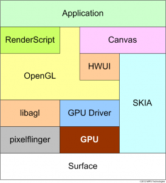
   
Canvas 가 HWUI와 SKIA를 이용해서 Surface로 요청

### 플러터 구조
- Embedder, 임베딩 레이어 : 플랫폼과 직접 통신하고 운영체제의 자체적 기능을 모듈화
    - 주로 특정 플랫폼에 Flutter 엔진을 설치하는 역할
- 엔진 레이어 : 대부분 C++, 플러터 코어 API와 스키아 그래픽 엔진, 파일시스템, 네티워크 기능 등 정의
- 프레임워크 레이어 : 플러터 프레임워크를 사용하는데 필수적인 위젯, 애니메이션, 패키지 등등
    - 사용자가 실제 코딩하는 부분

 

 ## Hello Flutter 앱 만들기

 ### VSCode 에서 프로젝트 생성하기
- 마켓 플레이스 Flutter 설치

 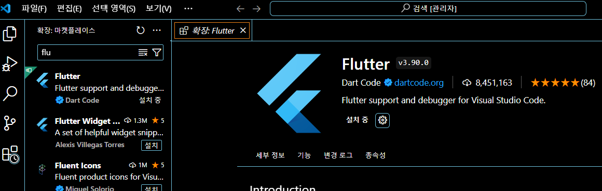


- Ctrl + Shift + p => flutter new project

 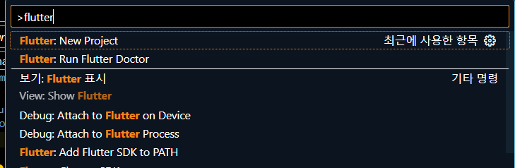


 ```dart
import 'package:flutter/material.dart';

void main() {
  runApp(MaterialApp(
    //머티리얼 디자인 위젯
    home: Scaffold(
      //Scaffold 위젯
      body: Center(
        child: Text('Hello world Factory'),
      ),
    ),
  ));
}
```

- 소스 작성 후 실행 하면 디바이스를 선택

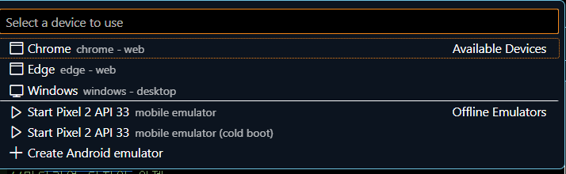

- MaterialApp : 머티리얼 디자인 기반의 위젯 사용
- Scaffold : 화면 전체를 차지하며 레이아웃을 도와주고 UI 관련 특수 기능 제공

### VSCode 실행 실패하여 Android Studio 디바이스 실행
- 디바이스 생성

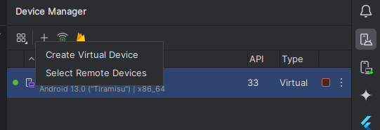

- 하드웨어 선택

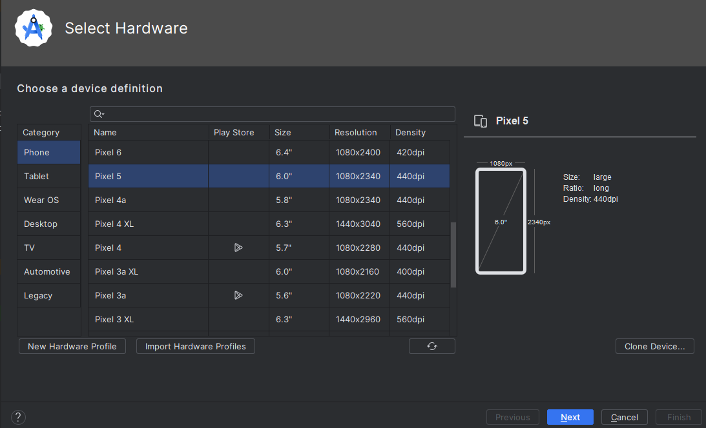

- 에뮬레이터 선택

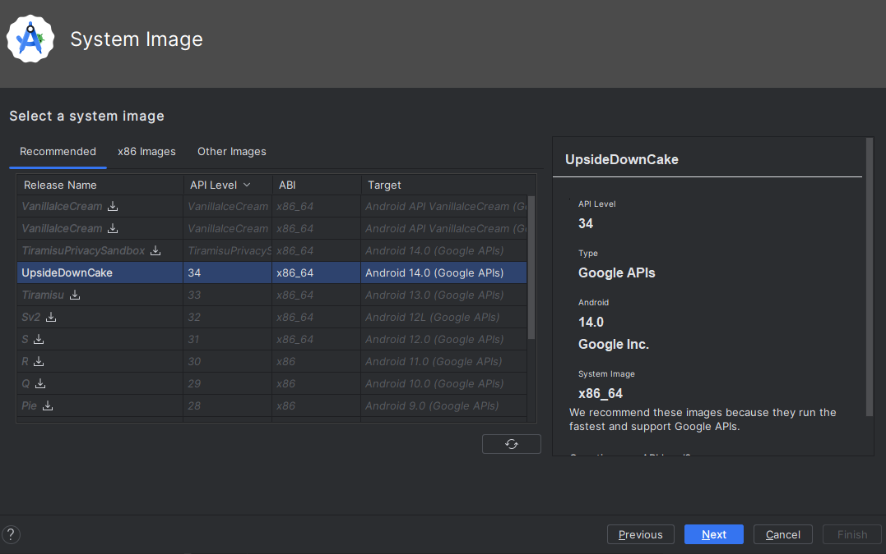

- 이름 지정

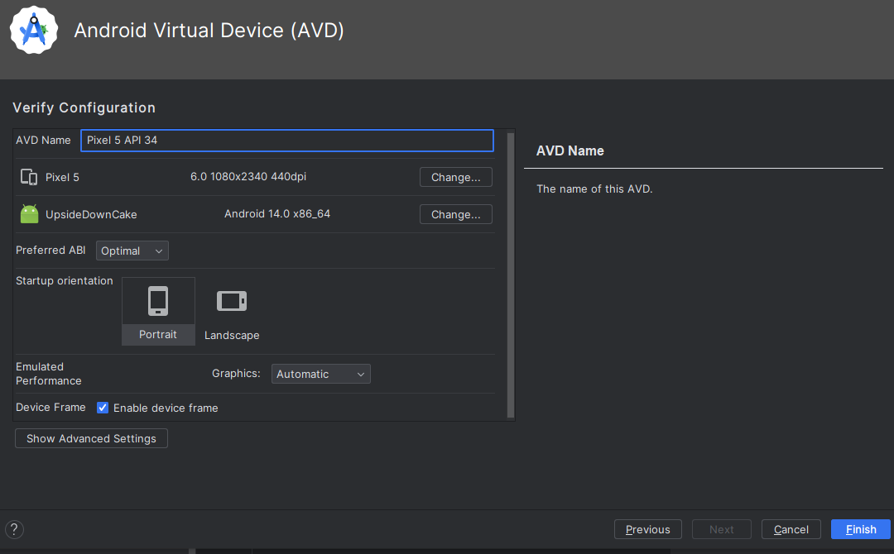

- 디바이스 표시 

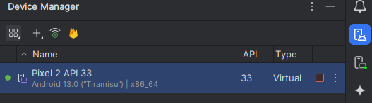


- 실행 완료

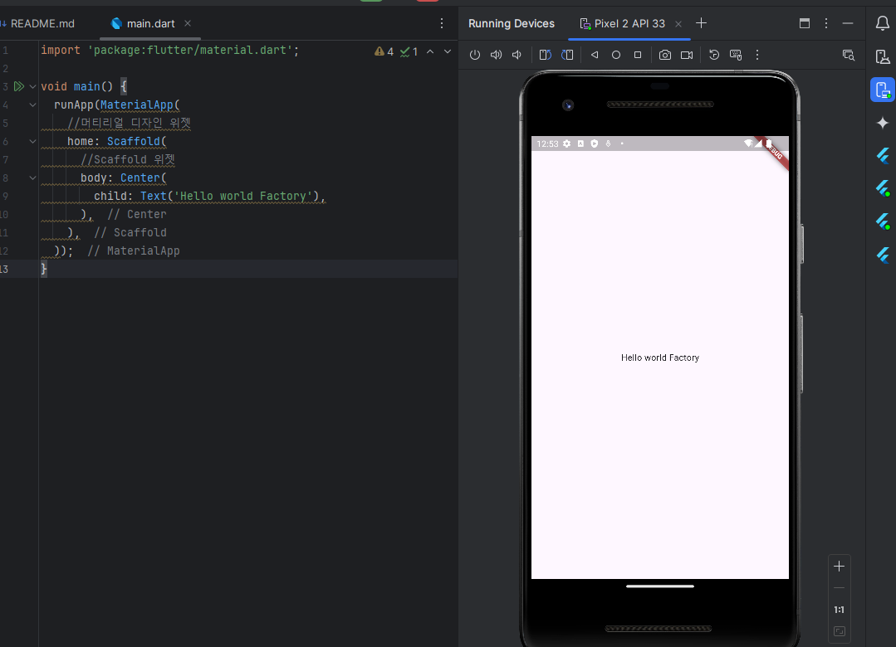


# 기본 위젯 

## 위젯 소개
- 플러터 화면에서 보여지는 UI와 관련된 모든 요소는 위젯으로 구성
- 위젯은 현재 주어진 상태(데이터) 기반으로 어떤 UI를 구현할지 정의

## 자식을 하나만 갖는 위젯
- 대체로 child 매개변수를 입력 받음
- Container 위젯 : 자식을 담는 컨테이너 역할
    -    배경색, 너비와 높이, 테두리 등의 디자인 지정
- GestureDetector 위젯 : 제스처 기능을 자식 위젯에서 인식하는 위젯
    - 탭이나 드래그 더블 클릭 같은 제스처 기능이 자식 위젯에 인식됐을 때 함수를 실행할 수 있음
- SizeBox 위젯 : 높이와 너비를 지정하는 위젯
    - Container 위젯과 다르게 디자인적 요소 적용 불가
    - const 생성자로 선언 가능해서 퍼포먼스 측면에서 효율

## 다수의 자식을 입력할 수 있는 위젯
- 대체로 children 매개변수 입력 리스트로 여러 위젯을 입력 가능
- Column 위젯 : children 매개변수에 입력된 모든 위젯을 세로로 배치
- Row 위젯 : 가로로 배치
- ListView 위젯 : 리스트 구현할 때 사용
    - 입력된 위젯이 화면을 벗어나게 되면 스크롤 가능


## Children 과 Child 의 차이점
- 플러터는 위젯 아래에 계속 위젯이 입력되는 형태로 위젯 트리를 구성하여 UI를 제작


- child 매개변수는 단 하나의 위젯만 입력 가능
```dart
import 'package:flutter/material.dart';

void main() {
  runApp(
    MaterialApp(
      home: Scaffold(
        body: Center(
          child: Text('hello world app'),
        ),
      ),
    )
  );
}
```
- children 매개변수는 리스트에 여러 위젯을 입력 가능
```dart
import 'package:flutter/material.dart';

void main() {
  runApp(
    MaterialApp(
      debugShowCheckedModeBanner: false,
      home: Scaffold(
        body: SizedBox(
          width: double.infinity,
          child: Column(
            mainAxisAlignment: MainAxisAlignment.center,

            children: [
              Text('Hello'),
              Text('world'),
              Text('Factory'),
            ],
          ),
        ),
      ),
    )
  );
}

```

## 텍스트 관련 위젯
- 글자를 적고 스타일링
- 첫 번째 포지셔널 파라미터에 문자열, style 네임드 파라미터에 스타일 지정
```dart
Text('원하는 문자열',
          style: TextStyle(
            fontSize: 16.0,
            fontWeight:FontWeight.w700,
            color: Colors.blue, 
          ),
      ),
```
## 제스처 관련 위젯
- 키보드로 글자를 입력하는 행위 외의 모든 입력을 제스처라 부름

### 버튼 위젯
- TextButton : 텍스트만 있는 버튼
- outlinedButton : 테두리가 있는 버튼
- ElevatedButton : 입체적 버튼

```dart 
Column(children: [//
          TextButton(onPressed: (){},
          style: TextButton.styleFrom(
            foregroundColor: Colors.red,
            ), 
            child: Text('텍스트버튼'),
          ),

          OutlinedButton(onPressed: (){},
            style: OutlinedButton.styleFrom(
              foregroundColor: Colors.red
            ), child:Text('아웃라인버튼')
           ),

           ElevatedButton(onPressed: (){},
            style: ElevatedButton.styleFrom(
              foregroundColor: Colors.red
            ), child:Text('엘리베이트버튼')
           ),
          ],
          ),
```

### IconButton 위젯
- 아이콘을 버튼으로 생성
- https://fonts.google.com/icons
```dart
IconButton(onPressed: (){},
          icon: Icon(Icons.home,),
          ),
```

### GestureDetector 위젯
- 손가락으로 하는 여러가지 입력을 인지하는 위젯

```dart
GestureDetector(
            onTap: (){
              print('on tap');
            },
            onDoubleTap: (){
              print('on double tap');
            },
            onLongPress: (){
              print('on long press');
            },
            
            //제스처를 적용할 위젯
            child: Container(
              decoration: BoxDecoration(
                color: Colors.red,
              ),
              width: 100.0,
              height: 100.0,
            ),
          ),
```

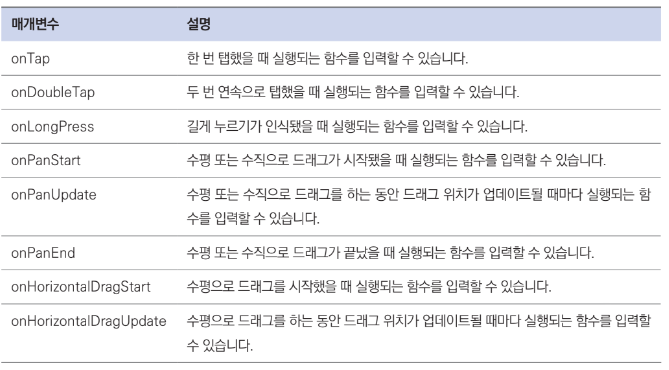
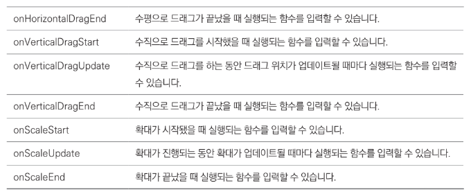
```

### FloatingActionButton 위젯
- 화면 오른쪽 아래 플로팅 작업 버튼
- UI 내에 특정 위치에 고정되어 떠있는 요소로 사용자에게 중요한 행동을 언제든지 클릭할 수 있도록 제공
```dart
home: Scaffold(
        floatingActionButton: FloatingActionButton(
          // 클릭했을 때 실행할 함수
          onPressed: () {},
          child: Text('클릭'),
          ),
          body: Container(),
      ),
```

## 디자인 관련 위젯
### Container 위젯
- 다른 위젯을 담는데 사용
    - 위젯 너비 높이 지정 및 배경이나 테두리 추가에 사용
- child 매개변수 사용 가능

```dart
Container(            
            decoration: BoxDecoration(              
              color: Colors.red,            
              border: Border.all(                
                width: 16.0,                
                color: Colors.black,
            ),            
            borderRadius: BorderRadius.circular(
              16.0,
            ),
          ),
          // 높이
          height: 200.0,
          // 너비
          width: 100.0,
          )
```

### SizeBox 위젯
- 일정 크기의 공간을 공백으로 두고 싶을 때 사용
- const 생성사를 사용했을 때 퍼포먼스에서 이점(불변성, 반복 생성 위젯에 사용)
```dart
void main() {
  runApp(
    MaterialApp(
      debugShowCheckedModeBanner: false,
      home: Scaffold(
        body: Center(
          child: Column(
            mainAxisAlignment: MainAxisAlignment.center,
            children: <Widget>[
              const SizedBox(height: 100.0), // const 사용
              Container(
                width: 100.0,
                height: 100.0,
                color: Colors.blue,
              ),
              const SizedBox(height: 20.0), // const 사용
              Container(
                width: 50.0,
                height: 50.0,
                color: Colors.red,
              ),
            ],
          ),
        ),
      ),
    ),
  );
}
```

### Padding 위젯
- child 위젯에 여백을 제공
- margin 은 위젯 바깥에 적용 가능(Container 위젯에 추가)
```dart
 margin: EdgeInsets.all(20.0),
 child: Padding(
                padding: EdgeInsets.all(16.0),
                child: Container(
                  color: Colors.red,
                  width: 30, height: 30,
                ),
              ),
```
- EdgeInsets 클래스

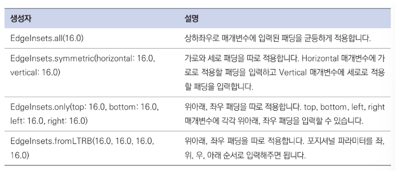

### SafeArea
- 기기별 예외 처리 없이 안전한(Safe) 화면에서만 위젯 그림(노치 제외)

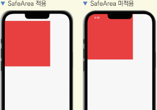

```dart
SafeArea(
    top: true,
    bottom: true,
    left:true,
    right: true,
    child: Container(
    ),
),

```

## 배치 관련 위젯
### Row / Column 위젯
- 위젯을 가로세로로 배치하는데 사용
- Row는 가로가 주축, 세로가 반대축 / Column 은 반대
- 주축 : mainAxisAlignment / 반대축 : crossAxisAligment / Column은 반대

```dart
void main() {
  runApp(RowWidgetExample());

}

class RowWidgetExample extends StatelessWidget {
  @override
  Widget build(BuildContext context) {

  return MaterialApp(
      home: Scaffold(
        body:
          SafeArea(
            top: true,
            child:SizedBox(
            height: double.infinity,
            width: double.infinity,
            child: Row(
              mainAxisAlignment: MainAxisAlignment.start,
              crossAxisAlignment: CrossAxisAlignment.start,

              children:[
                Container(
                  height: 50,
                    width: 50,
                  color: Colors.red,
                ),
                const SizedBox(width: 12, height: 12,),
                Container(
                  height: 50,
                  width: 50,
                  color: Colors.green,
                ),
                const SizedBox(width: 12, height: 12,),
                Container(
                  height: 50,
                  width: 50,
                  color: Colors.blue,
                )
              ]
            ),
          ),
          ),
      )
      );
  }
}
```
- Row 기준
    - MainAxisAlignment 옵션(cross.center 기준)

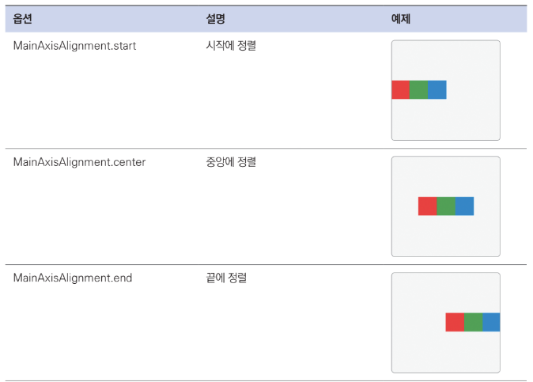
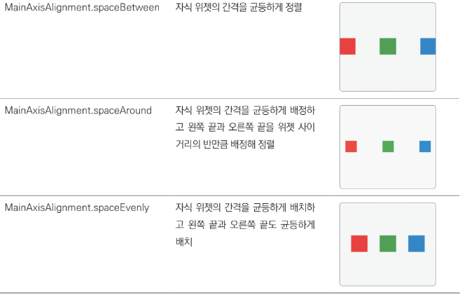

    - CrossAxisAlignment 옵션(main.center 기준)

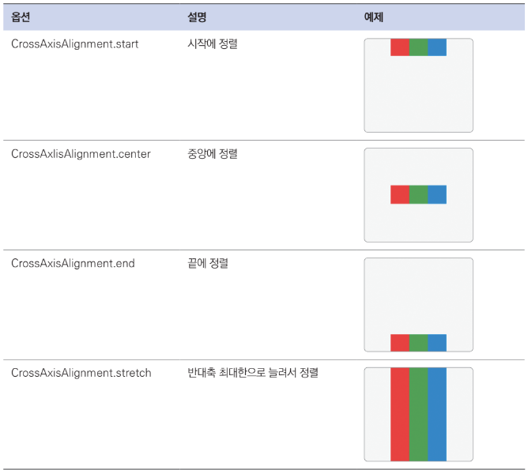

- Column 기준
    - MainAxisAlignment 옵션(cross.center 기준)
    
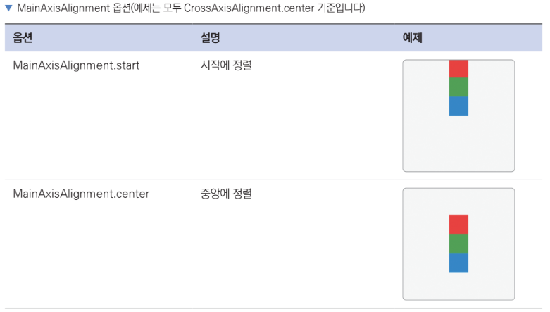
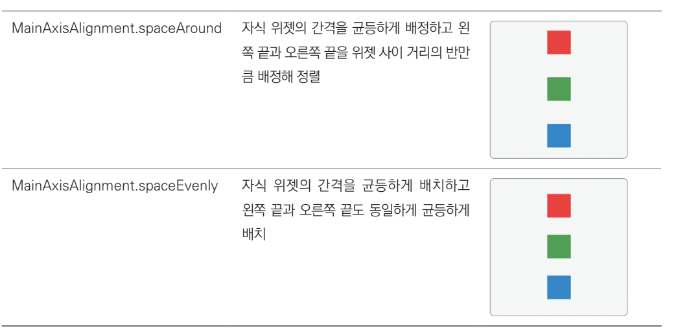

        - CrossAxisAlignment 옵션(main.center 기준)

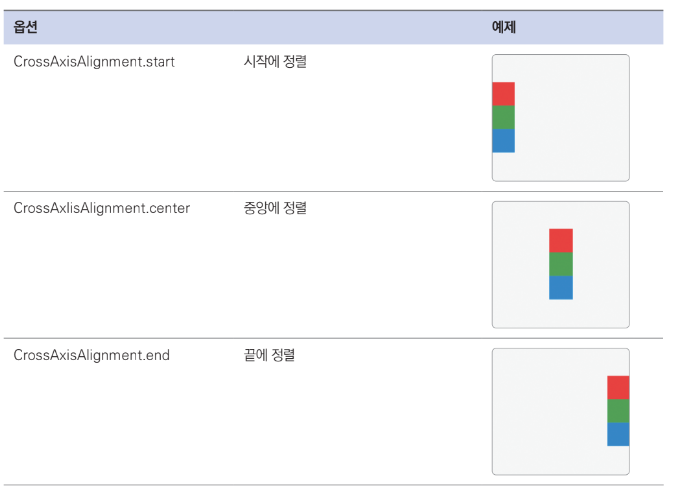
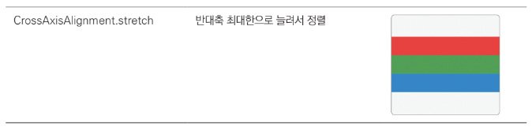

### Flexible 위젯
- Row 와 Coulumn 에서 사용
- 부모의 공간을 자식 위젯이 차지하도록 도와주는 위젯
    - FlexFit.tight : 가능한 모든 공간 차지
    - FlexFit.loose : 필요한 만큼 공간만 차지

```dart
child: Row(
                  mainAxisAlignment: MainAxisAlignment.start,
                  crossAxisAlignment: CrossAxisAlignment.start,

                  children:[
                    Flexible(
                      flex:1,
                      child: Container(
                        color: Colors.red,
                      ),
                    ),
                    Flexible(
                      flex: 2,
                      child: Container(
                        color: Colors.green,
                      ),
                    ),
                  ]
              ),
```

- FlexFit.loose 를 사용하면 지정한 만큼의 공간만 차지

```dart
 children:[
                    Flexible(
                      fit: FlexFit.loose,
                      child: Container(
                        color: Colors.red,
                        width: 100,
                      ),
                    ),
                    Flexible(
                      fit: FlexFit.loose,
                      child: Container(
                        color: Colors.green,
                        width: 100,
                      ),
                    ),
                  ]
```

### Expanded 위젯
- Flexible 위젯 상속
- 위젯이 남아 있는 공간을 최대한으로 상속
    - FlexFit.tight 를 기본으로 제공해준 위젯 

```dart
 children:[
                    Expanded(                     
                      child: Container(
                        color: Colors.red,                     
                      ),
                    ),
                    Flexible(
                      fit: FlexFit.loose,
                      child: Container(
                        color: Colors.green,
                        width: 100,
                      ),
                    ),
                  ]
```

### Stack 위젯
- 위젯을 겹치는 기능을 제공
- 작성 순서대로 위젯을 겹침

```dart
Stack(

                  children:[
                    Container(
                      color: Colors.red,
                      width: 300,
                      height: 300,
                    ),

                    Container(
                        color: Colors.green,
                      width: 150,
                      height: 150,
                    ),

                  ]
              ),
```