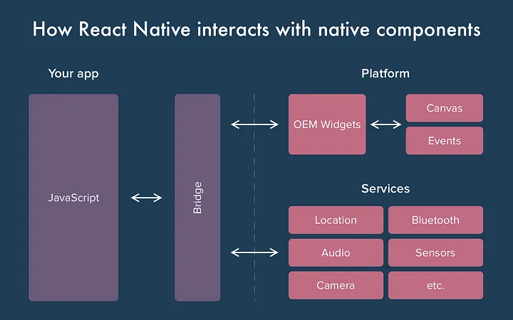
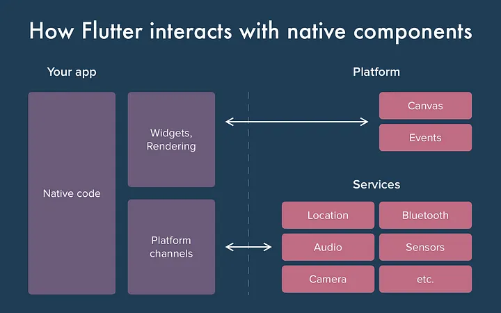
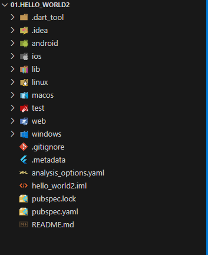
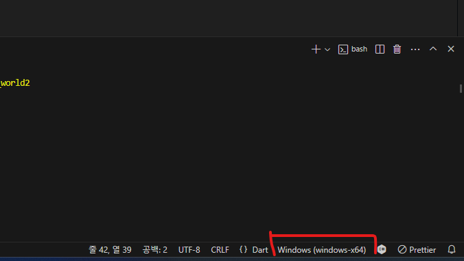
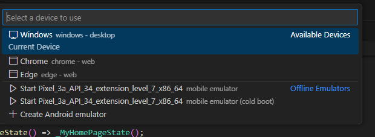
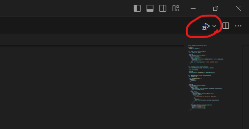
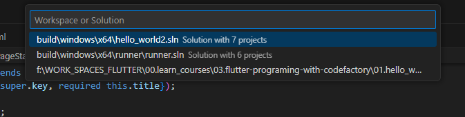
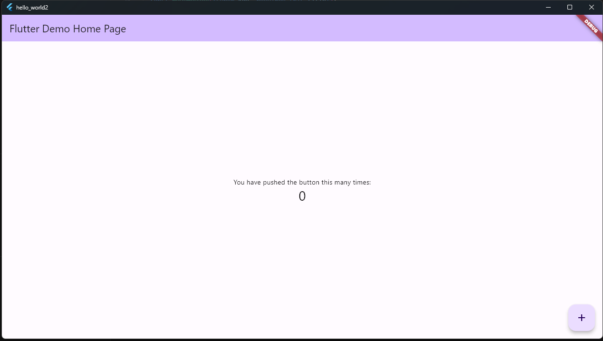

# 플러터 입문
## 플러터소개

- Enbedder 계층
    - 각 플랫폼과 직접 통신을 함
    - 각 플랫폼의 자체기능 모듈을 모아놓음
- Engine 계층
    - 플러터의 핵심
    - C/C++로 개발되어 있음
    - Flutter 코어 API
        - 그래픽 엔진
        - 파일 시스템
        - 네트워크
        - 런타임
- Framerowk 계층
    - 실제 개발 시 사용하는 기능들


- Dart App
    1. 위젯을 원하는 UI로 한다.
    2. 비즈니스 로직을 구현한다.
- Framework
    1. 고품질 앱(예: 위젯, 히트 테스트, 제스처 감지, 접근성, 텍스트 입력)을 구축하기 위한 상위 수준의 API를 제공한다.
    2. 앱의 위젯 트리를 장면으로 합성한다.
- Engine
    1. 합성된 장면의 래스터화를 담당한다.
    2. Flutter의 핵심 API(예: 그래픽, 텍스트 레이아웃, Dart 런타임)의 로우레벨 구현을 제공한다.
    3. dart:ui API를 사용하여 프레임워크에 해당 기능을 제공한다.
    4. 엔진의 임베더 API를 사용하여 특정 플랫폼과 통합한다.
- Enbedder
    1. 렌더링 표면, 접근성 및 입력과 같은 서비스에 대한 액세스를 위해 기본 운영 체제와 관련 동작을 수행한다.
    2. 이벤트 루프를 관리한다.
    3. 임베더를 앱에 통합하기 위한 플랫폼별 API를 제공한다.
- Runner
    1. 임베더의 플랫폼별 API에 노출된 부분을 대상 플랫폼에서 실행 가능한 앱 패키지로 구성한다.
    2. 앱 개발자가 소유한 Flutter Create에서 생성된 앱 템플릿의 일부이다.

## React Native VS Flutter



## 추천하는 VS Code Extensions 1
- Dart
- Flutter
- Awesome Flutter Snippets
- Pubspec Assist
- Error Lens
- Image preview
- Bracket Pair Colorizer2
- Color Highlight
- Flutter Stylizer

## 추천하는 VS Code Extensions 2
- Dart Data Class Generator
- JSON to Dart Model

## Create Flutter App
```shell
$ flutter create hello_world
```


## Debug Flutter App










## 기본 위젯 https://docs.flutter.dev/ui/widgets/basics
- AppBar
    - https://api.flutter.dev/flutter/material/AppBar-class.html
- Scaffold
    - https://api.flutter.dev/flutter/material/Scaffold-class.html


### Text 관련 위젯
- Text
    - https://api.flutter.dev/flutter/widgets/Text-class.html

### Layout 위젯: https://docs.flutter.dev/ui/widgets/layout
- Container
- Center
- AspectRatio
- Expended
- FittedBox
- Padding
- SizedBox
- Column
- GridView
- LayoutBuilder
- ListView
- Row
- Stack
- SliverGrid, SliverList
- Flexible

### 제스쳐 위젯
1. 버튼
    - ElevatedButton: https://api.flutter.dev/flutter/material/ElevatedButton-class.html
    - TextButton
    - IconButton
    - OutlinedButton
3. GestureDetector
    - https://api.flutter.dev/flutter/widgets/GestureDetector-class.html
    - 많이 사용하는 Gestures 종류

        |매개변수|설명|
        |:---|:---|
        |onTab|한번탭|
        |onDoubleTab|더블탭|
        |onLongPress|길게누르기|
        |onPanStart|가로,세로로 스윕 시작|
        |onPanUpdate|가로,세로로 스윕|
        |onPanEnd|가로,세로로 스윕 종료|
        |onHorizonDragStart|가로 방향으로 스윕 시작|
        |onHorizonDragUpdate|가로 방향으로 스윕|
        |onHorizonDragEnd|가로 방향으로 스윕 종료|
        |onVerticalDragStart|세로 방향으로 스윕 시작|
        |onVerticalDragUpdate|세로 방향으로 스윕|
        |onVerticalDragEnd|세로 방향으로 스윕 종료|
        |onScaleStart|화면 확대 시작|
        |onScaleUpdate|화면 확대|
        |onScaleEnd|화면 확대 종료|
3. FloatingActionButton

### 디자인 관련 위젯
- Icon
    - https://api.flutter.dev/flutter/widgets/Icon-class.html
- Image
    - https://api.flutter.dev/flutter/widgets/Image-class.html
