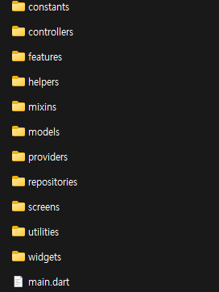
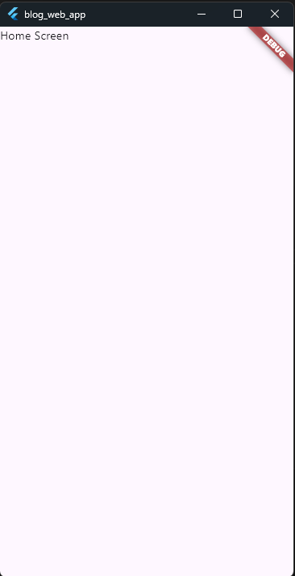

# 플러터 입문

## 그 밖의 지식

### 앱개발 프로세스

1. 기획
2. 사전 지식
   - 필요한 지식 학습
3. 사전 준비
   - 프로젝트 생성 및 설정
4. 레이아웃 구상
   - 프로토타입 생성
     - 피그마
     - XD
     - FlutterFlow
5. 구현

   - 일반적인 디렉토리 구조
     - screen
     - components
     - model
     - const
   - 팀에 따라 프로젝트에 따라 자유롭게 설정 가능

     

   - 개발 테스트
     - Provider 단위테스트
     - 위젯 테스트
     - 앱 UI 테스트
     - 성능테스트

6. 테스트
   - 실제 단말 테스트: 타겟 디바이스를 설정 하고 모두 테스트해야 함.

### 플러그인 추가

- `pubspec.yaml` 파일에서 플러그인, 라이브러리 관리를 하고 있음

  

- 플러그인 추가 방법
  - terminal
  - pubspec.yaml
  - IDE

### 주변장치

- 센서
- GPS
- 카메라
- 블루투스
- 와이파이

## 블로그 웹앱

### 사전지식

1. 콜백
   > 다른 코드의 인수로서 넘겨주는 실행 가능한 코드를 말한다(위키백과)

    ```dart
    WebviewController controller = WebviewController()
        ..setNavigationDelegate(
            // void 타입의 콜백
            onPageFinished: (String url) {
                print(url)
            }
        );
    ```

2. 웹뷰
   - 프레임워크에 내장된 브라우저를 앱의 네이티브 컴포넌트에 임베딩 하는 기능  
     -> 앱에서 웹브라우저를 사용 하겠다는 의미
   - 느리지만 사용 하는 이유: 기존에 개발 했던 웹 애플리케이션을 쉽게 활용 가능하기 때문
   - PG 같은 기능을 쉽게 구현 가능
3. 안드로이드와 IOS 네이티브 설정
   - 플러터 기능만으로 네이티브 플랫폼 기능에 접근 할 수 없음.
     - 인터넷
     - 카메라
     - 푸시
     - 디바이스 저장소 등

### 사전 준비

1. `pubspec.yaml` 설정

   ```yaml
   dependencies:
     flutter:
       sdk: flutter

   webview_flutter: ^4.8.0 # 웹뷰 플러그인
   ```

2. 네이티브 권한 설정

   1. 안드로이드 설정

      - 웹뷰를 사용 하기 위해서는 인터넷, HTTPS 프로토콜, HTTP 프로토콜 기능이 필요함
      - `manifest` 설정

        ```xml
        <manifest xmlns:android="http://schemas.android.com/apk/res/android" package="...">
            <use-permission android:name="android.permission.INTERNET" />
            ...
        </manifest>
        ```

      - 자주 사용하는 안드로이드 권한
        |권한|코드|
        |---|---|
        |카메라|`<uses-permission android:name="android.permission.CAMERA"/>`|
        |위치 정보 |`<uses-permission android:name="android.permission.ACCESS_FINE_LOCATION"/>`|
        ||`<uses-permission android:name="android.permission.ACCESS_COARSE_LOCATION_LOCATION"/>`|
        |녹음 |`<uses-permission android:name="android.permission.RECORD_AUDIO"/>`|
        |전화 |`<uses-permission android:name="android.permission.READ_PHONE_STATE"/>`|
        ||`<uses-permission android:name="android.permission.MODIFY_PHONE_NUMBER"/>`|
        ||`<uses-permission android:name="android.permission.CALL_PHONE"/>`|
        ||`<uses-permission android:name="android.permission.ANSWER_PHONE_CALLS"/>`|
        ||`<uses-permission android:name="android.permission.READ_CALL_LOG"/>`|
        |문자 |`<uses-permission android:name="android.permission.SEND_SMS"/>`|
        ||`<uses-permission android:name="android.permission.RECEIVE_SMS"/>`|
        ||`<uses-permission android:name="android.permission.CALL_PHONE"/>`|
        ||`<uses-permission android:name="android.permission.READ_SMS"/>`|
        ||`<uses-permission android:name="android.permission.RECEIVE_WAP_PUSH"/>`|
        ||`<uses-permission android:name="android.permission.RECEIVE_MMS"/>`|
        |캘린더 |`<uses-permission android:name="android.permission.READ_CALENDAR"/>`|
        ||`<uses-permission android:name="android.permission.WRITE_CALENDAR"/>`|

      - `http`연결 허용 설정  
         `https`를 사용한다면 설정 불필요.
        ```xml
          ...
          <application
              android:label="blog_web_app"
              android:name="${applicationName}"
              android:icon="@mipmap/ic_launcher"
              android:usesCleartextTraffic="true"> <!-- ndroid:usesCleartextTraffic="true" 설정 -->
          ...
        ```

   2. iOS 설정

   - 자주 사용하는 iOS 권한

     | 키값                            | 설명                | 기타                                                                                                                    |
     | ------------------------------- | ------------------- | ----------------------------------------------------------------------------------------------------------------------- |
     | ~~NSCalendarsUsageDescription~~ | 달력사용권한        | **Deprecated** NSCalendarsFullAccessUsageDescription 와 NSCalendarsWriteOnlyAccessUsageDescription 로 구분되어 나뉘어짐 |
     | NSCameraUsageDescription        | 카메라사용권한      |                                                                                                                         |
     | NSContactsUsageDescription      | 연락처사용권한      |                                                                                                                         |
     | NSLocationUsageDescription      | 위치정보사용권한    |                                                                                                                         |
     | NSPhotoLibraryUsageDescription  | 사진접근권한        |                                                                                                                         |
     | NSFaceIDUsageDescription        | Face Id 접근권한    |                                                                                                                         |
     | NSMicrophoneUsageDescription    | 마이크 접근권한     |                                                                                                                         |
     | NSMotionUsageDescription        | 가속도센서 접근권한 |                                                                                                                         |
     | NSSiriUsageDescription          | 시리 접근권한       |                                                                                                                         |

   - `Info.plist` 설정

     ```plist
     ...
     <dict>
         <key>NSAppTransportSecurity</key>
         <dict>
             <key>NSAllowsLocalNetworking</key>
             <true />
             <key>NSAllowsArbitraryLoadsInWebContent</key>
             <true />
         </dict>
     </dict>
     ...
     ```

   - 실행중 필요한 권한은 디버그 메세지로 표시 되기 때문에 확인 후 추가해도됨.

### 프로젝트 초기화

1. `home_screen.dart` 생성

   ```dart
   // home_screen.dart

   import 'package:flutter/material.dart';

   class HomeScreen extends StatelessWidget {

       const HomeScreen({super.key});

       @override
       Widget build(BuildContext context) {
           return Scaffold(
               body: const Text('Home Screen'),
           );
       }
   }

   // main.dart
   ...
   return MaterialApp(
        title: 'Flutter Demo',
        theme: ThemeData(
            colorScheme: ColorScheme.fromSeed(seedColor: Colors.deepPurple),
            useMaterial3: true,
        ),
        home: const HomeScreen(),
   );
   ...
   ```

   

### 레이아웃 구상하기

    - 앱바: 제목과 홈버튼
    - 웹뷰: 지정한 URL의 내용을 보여줌

### 구현하기

1. Flow
   1. 사용자가 앱을 실행 하면 웹뷰에 화면 표시
   2. 홈버튼 누르면 처음 페이지로 이동
2. 소스구현: 앱 참조
