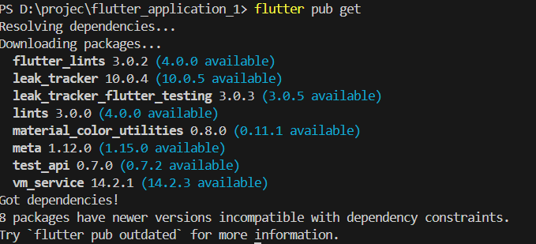
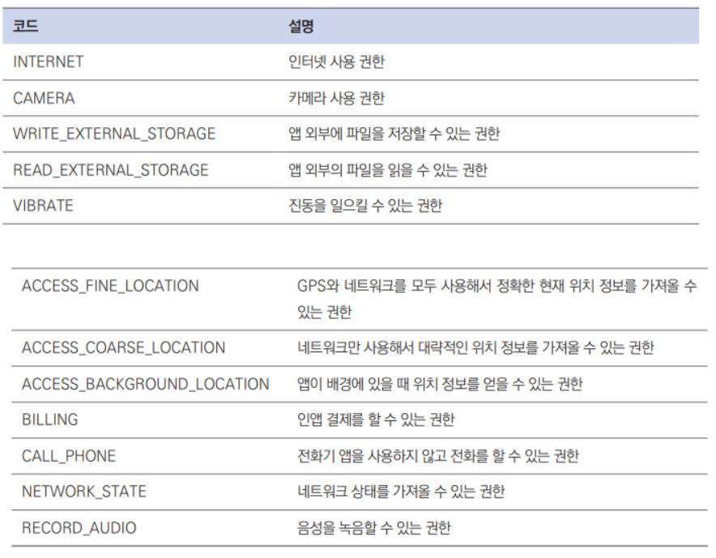
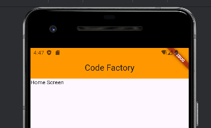

# 블로그 웹 앱
## 사전 지식
### 콜백 함수
- 일정 작업이 완료되면 실행되는 함수
- 함수를 정의하면 특정 조건이 성립 될 때 실행

```dart 
WebViewController controller = WebViewController()
    ..setNavigationDelegate(NavigationDelegate(
        //로딩 완료 후 실행
        onPageFinished: (String url){
            print(url);
        }
    ))
```

### 웹뷰 위젯
- 프레임워크에 내장된 브라우저를 앱의 네이트브 컴포넌트에 임베딩 하는 기능
    - 앱에서 웹 브라우저 기능을 구현해주는 기술
- 기존에 만든 웹사이트 활용

- 웹뷰 컨트롤러에서 사용하는 함수


## 사전 준비
### pubspec.yaml 설정
- webview_flutter 플러그인 추가하고 pub get 실행

```dart
dependencies:
    flutter:
        sdk: flutter
cupertino_icons: ^1.0.2
webview_flutter: 4.4.1

```

- 터미널에서 pub get 실행



### 권한 및 네이트브 설정
- 인터넷 사용 권한을 추가하고 https, http 프로토콜 사용
- AndoridMainfest.xml 파일에 추가
    - <uses-permission android:name="android.permission.INTERNET" />

- 자주 사용하는 안드로이드 권한 코드



- http 프로토콜 허용
    - AndoridMainfest.xml 파일에 추가
    - android:usesClearetextTraffic="true"

### 프로젝트 초기화
- lib/screen/home_screen.dart 파일 생성

```dart
import 'package:flutter/material.dart';

class HomeScreen extends StatelessWidget{
  const HomeScreen({Key? key}): super(key:key);

  @override
  Widget build(BuildContext contex){
    return Scaffold(
      body: Text('Home Screen'),
    );
  }

}
```

- main.dart 에서 앱의 첫화면 설정
```dart
import 'package:blog_web_app/screen/home_screen.dart';
import 'package:flutter/material.dart';

void main() {
  runApp(
    MaterialApp(
      home: HomeScreen(),
    ),
  );
}

```


## 레이아웃 구상 및 구현
### 구상
- 앱바와 웹뷰로 구성
- 앱바는 제목과 홈 버튼 렌더링
- 웹뷰는 지정한 URL 페이지 보여줌

### 앱바 구현
```dart
import 'package:flutter/material.dart';
import 'package:webview_flutter/webview_flutter.dart';

class HomeScreen extends StatelessWidget{
  WebViewController webViewController = WebViewController();

  HomeScreen({Key? key}): super(key:key);

  @override
  Widget build(BuildContext contex){
    return Scaffold(
      appBar: AppBar(
        backgroundColor: Colors.orange,
          title: Text('Code Factory'),
          centerTitle: true,
      ),
      body: Text('Home Screen'),
    );
  }

}
```
- 앱바 표시



### 웹뷰 구현
```dart
import 'package:flutter/material.dart';
import 'package:webview_flutter/webview_flutter.dart';

class HomeScreen extends StatelessWidget{
  WebViewController webViewController = WebViewController()
    ..loadRequest(Uri.parse('https://blog.codefactory.ai'))
    ..setJavaScriptMode(JavaScriptMode.unrestricted);

  HomeScreen({Key? key}): super(key:key);

  @override
  Widget build(BuildContext contex){
    return Scaffold(
      appBar: AppBar(
        backgroundColor: Colors.orange,
          title: Text('Code Factory'),
          centerTitle: true,
      ),
      body: WebViewWidget(
        controller: webViewController,
      ),
    );
  }

}
```

### 홈버튼 구현
```dart
actions: [IconButton(
            onPressed: (){
              webViewController.loadRequest(Uri.parse('https://blog.codefactory.ai'));
            },
            icon: Icon(Icons.home),),],

```

