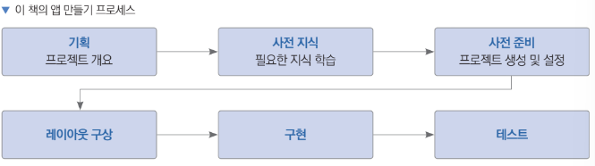
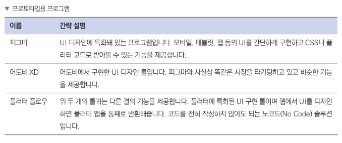
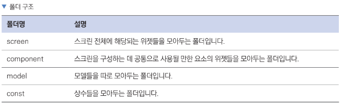
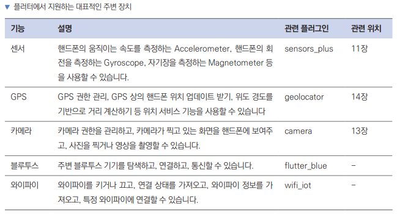
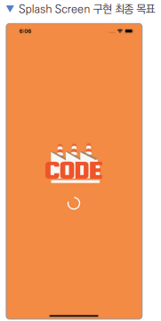
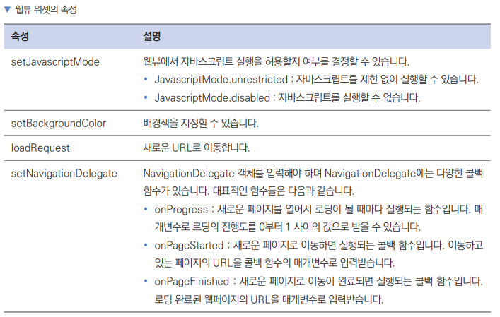
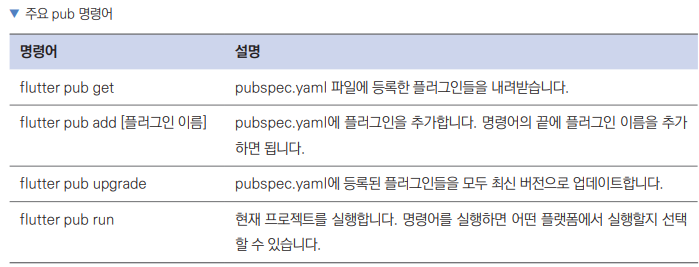
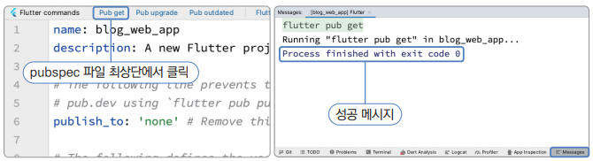
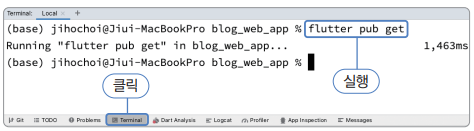
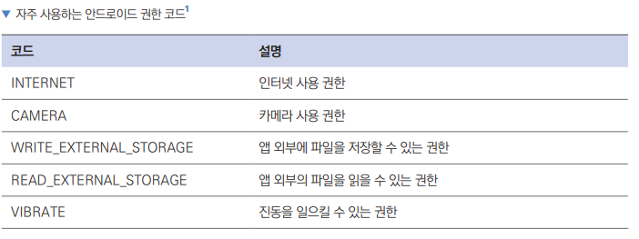

# 단계3 - 앱을 만들며 유용한 기능 익히기
## ch07 앱을 만들려면 알아야 하는 그 밖의 지식
### 7.1 앱 만들기 프로세스
- 현업 : 기획 -> UI 구상하기 -> 테스트
- 개발 : 앱을 개발하는 흐름은 현업의 순서와 비슷한 순서로 진행하며 아래 표를 참조  

- 현업에서 UI로 레이아웃을 구성할 때는 프로토타입을 만들어 볼 수 있는 피그마, 어도비 XD, 플러터 플로우 
프로그램이 있음  

- 구현할 때는 폴더 구조를 잘 잡아야 협업이 편하고 유지보수가 용이함  

### 7.2 플러그인 추가 방법
- pubspec.yaml 파일에 원하는 플러그인 추가
- [pub.get] 버튼을 눌러주면 등록한 플러그인을 프로젝트에서 사용가능
- WebView 플러그인 추가 예시
    ```dart
    // 플러그인을 여기에 등록하면 됨
    dependencies:
      flutter:
        sdk: flutter

      cupertino_icons: ^1.0.2
      webview_flutter: 2.3.1 // 웹뷰 플러그인 추가
    ```
    
### 7.3 주변 장치 종류
- 플러터 프레임워크는 다양한 하드웨어 기능을 제공하기 때문에 스마트폰에서 장치를 손쉽게 사용할 수 있음  
  
### 7.4 연습용 앱 만들기 : 스플래시 스크린 앱
- 앱이 로딩되는 동안 보이는 스플래시 스크린을 간단하게 구현
- 위젯을 화면에 배치하는 Row 위젯과 Column 위젯을 사용  


7.4.1 사용자 정의 위젯 만들기 : 스테이트리스 위젯
- 프로젝트 생성
  - 프로젝트 이름 : splash_screen
  - 네이티브 언어 : 코틀린, 스위프트
- 위젯의 형태는 2가지로 나뉨
  - 스테이트풀 위젯
    - 위젯의 내부에서 값이 변경되었을 대 위젯 자체에서 다시 렌더링을 실행시킬 수 있는 위젯
  - 스테이트리스 위젯
    - 위젯 내부에서 값이 변경되어도 위젯 자체적으로는 다시 렌더링할 수 없는 위젯
    ```dart
    // 스테이트리스 위젯(플러터의 가장 기본이 되는 위젯)
    
    import 'package:flutter/material.dart';

    void main() {
    runApp(SplashScreen()); // SplashScreen 위젯을 첫 화면으로 지정
    }

    class SplashScreen extends StatelessWidget {    // StatelessWidget 선언
        @override
        Widget build(BuildContext context) {    // 위젯의 UI 구현
        }
    }
    ```
    - StatelessWidget 클래스를 상속받으면 build() 함수를 필수적으로 오버라이드하고 해당 영역에 그려주고 싶은 위젯을 입력
    - runApp() 에 사용자 정의해서 만든 SplashScreen 위젯을 매개변수로 제공하여 앱 전체 화면으로 사용
    ```dart
    // MaterialApp 위젯과 Scaffold 위젯 작성
    
    class SplashScreen extends StatelessWidget {
      @override
      Widget build(BuildContext context) {
        return MaterialApp( // 항상 최상단에 입력되는 위젯
          home : Scaffold(  // 항상 두 번째로 입력되는 위젯
            body : Center(  // 중앙 정렬 위젯
              //  글자를 화면에 보여주는 위젯
              child: Text('Splish Screen'),
            ),
          ),
        );
      }
    }   
    ```
    buiid() 함수가 위젯의 UI를 결정한다는 것을 알 수 있음

7.4.2 배경색 바꾸기 : Container와 BoxDecoration 위젯
- 배경 관련 UI를 변경할 때 Container 위젯을 가장 많이 사용함
```dart
// 배경색을 화면 전체에 적용하기 위해 Scaffold 위젯 바로 아래에 Container 위젯을 적용

import 'package:flutter/material.dart';

void main() {
runApp(SplashScreen());
}

class SplashScreen extends StatelessWidget {
    @override
    Widget build(BuildContext context) {
        return MaterialApp(
            home: Scaffold(
                body: Container(    // 컨테이너 위젯
                // 컨테이너를 디자인하는 클래스
                decoration: BoxDecoration(  // 배경색, 테두리 색상, 테두리 두께 등 지정 가능
                    color: Colors.orange,   // 색상
                ),
                child: Center(
                    child: Text('Splash Screen'),
                ),
                ),
            ),
        );  
    }
}
```
7.4.3 이미지 출력하기 : Image 위젯
- Text 위젯 대신에 이미지를 보여줄 Image 위젯을 사용
- image 5 가지 생성자
  - 기본 Image 생성자 : ImageProvider라는 또 다른 위젯에서 이미지를 그림
  - Image.asset 생성자 : 앱에 저장된 asset 파일로 이미지를 그림
  - Image.network 생성자 : URL을 통해서 이미지를 그림
  - Image.file 생성자 : 파일을 통해서 이미지를 그림
  - Image.memory 생성자 : 메모리에서 직접 이미지를 그림

- 앱에 저장해둔 asset 파일로 이미지를 그려낼 수 있는 Image.asset 생성자를 사용하는 방법
  - 깃에서 내려받은 예제 이미지 logo.png를 프로젝트 하단에 [assets] 폴더를 생성하고 드래그 앤 드롭으로 넣어줌
  - [assets] 폴더에 로고 파일을 추가했지만 사용하기 위해 pubspec.yaml 설정파일에 지정
    ```dart
    // pubspec.yaml 파일 설정(사용할 폰트, 이미지, 외부 플러그인 등을 지정하는데 사용)

    // flutter.assets라는 키에 [assets] 폴더를 지정
    
    flutter:
    
    # The following line ensures that the Material Icons font is
    # included with your application, so that you can use the icons in
    # the material Icons class.
    uses-material-design: true
    
    # To add assets to your application, add an assets section, like this:
    assets: // # 주석처리를 풀어줌
      - assets/ // # 이미지를 담을 폴더 이름을 기입(-기호는 리스트값을 의미, 원하는 만큼 -로 시작하는 값 추가가능)
    ```
    pubspec.yaml 설정파일을 변경했으므로 [pub get] 기능 클릭하여 실행 또는 터미널로 flutter pub get 실행
    ```dart
    // Text 위젯을 Image 위젯으로 변경 및 주변색과 동일하게 헥스 코드 사용
    class SplashScreen extends StatelessWidget {
      @override
      Widget build(BuildContext context) {
        return MaterialApp(
          home: Scaffold(
            body: Container(    // 컨테이너 위젯
              // 컨테이너를 디자인하는 클래스
              decoration: BoxDecoration(  // 배경색, 테두리 색상, 테두리 두께 등 지정 가능
                color: Colors.orange,   // 색상
              ),
              child: Center(
                child: Image.asset(
                  'assets/logo.png',
                ),
              ),
            ),
          ),
        );
      }
    } 
    ```
7.4.4. 위젯 정렬하기 : Row & Column 위젯
- 로고 아래에 동그라미 형태의 로딩 애니메이션을 사용하려고 함
- 세로로 가운데 정렬이 필요하나 Center 위젯은 child에 위젯을 하나만 받을 수 있음
- Row와 Column 위젯은 children 매개변수에 리스트로 원하는 만큼 위젯을 추가할 수 있음
- child를 Center에서 Column으로 변경하고 children 매개변수에 Image 위젯과 CircularProcessIndicator를 모두 넣어줌
- mainAxisAlignment: MainAxisAlignment.center 매개 변수를 추가하여 children에 포함된 위젯들을 재배치 할 수 있음
- width 에 200 픽셀을 입력해서 로고 너비 조정
- Column : 세로로 최대크기 차지, 가로로 최소 크기 차지
- Row : 가로로 최대크기 차지, 세로로 최소 크기 차지
- Row로 Column을 감싸주고 mainAxisAlignment: MainAxisAlignment.center 로 가운데 정렬
- CircularProgressIndicator의 색상 변경은 valueColor 매개변수를 사용하며 AlwaysStoppedAnimation 클래스에 감싸서 사용 
```dart
import 'package:flutter/material.dart';

void main() {
  runApp(SplashScreen());
}

class SplashScreen extends StatelessWidget {
  @override
  Widget build(BuildContext context) {
    return MaterialApp(
      home: Scaffold(
        body: Container(
          decoration: BoxDecoration(
            color: Color(0xFFF99231),
          ),
          child: Row(
            mainAxisAlignment: MainAxisAlignment.center,    // 가운데 정렬 추가
            children: [
              Column(
                mainAxisAlignment: MainAxisAlignment.center,    // 가운데 정렬 추가
                children: [
                  Image.asset(
                    'assets/logo.png',
                    width: 200,
                  ),
                  CircularProgressIndicator(
                    valueColor: AlwaysStoppedAnimation(     // 로딩 아이콘 색상 변경
                      Colors.white,
                    ),
                  ),
                ],
              )
            ],
          ),
        ),
      ),
    );
  }
}
```
## ch08 블로그 웹 앱

학습순서
- 사전지식
    - 콜백 함수
    - 웹뷰 위젯
    - 네이티브 설정
- 사전준비
    - pubspec.yaml 설정
    - 권한 및 네이티브 설정
    - 프로젝트 초기화
- 레이아웃구성
- 구현하기
    - 앱바
    - 웹뷰
    - 웹뷰 컨트롤러
    - 홈 버튼
- 테스트하기
### 8.1 사전 지식
8.1.1 콜백 함수
- 콜백 함수는 일정 작업이 완료되면 실행되는 함수
- 함수를 정의해두면 바로 실행되지 않고 특정 조건이 성립될 때 실행
```dart
// 유저가 화면을 터치했을 때 실행할 함수나 웹뷰의 로딩이 완료되면 실행할 콜백 함수 예시

WebViewController controller = WebViewController()
  ..setNavigationDelegate(NavigatinoDelegate(
  // 로딩 완료 후 실행되는 함수
    onPageFinished: (String url){
      print(url);
    }
  ))
```
8.1.2 웹뷰 위젯
- 프레임워크에 내장된 브라우저를 앱의 네이티브 컴포넌트에 임베딩하는 기능
- 쉽게 말해 앱에서 웹 브라우저 기능을 구현해주는 기술
- 웹뷰는 네이티브 컴포넌트에 비해 속도가 느리고 애니메이션이 부자연스럽다는 단점이 있음
- 기존에 만든 웹사이트를 웹뷰를 사용하면 코드 몇 줄로 해당 사이트를 앱에 웹뷰로 탑재해서 앱을 출시할 수 있음
- 예를들어 웹으로 개발된 결제 모듈 기능을 그대로 가져와 앱에서 활용할 수 있어 추가 개발비용과 시간 절약할 수 있음

`controller 와 WebViewController`
- 웹뷰를 구현할 때 사용할 웹뷰 위젯은 controller 파라미터에 WebViewController 객체를 입력해줘야함
- 웹뷰 컨트롤러는 웹뷰 위젯을 제어하는데 필요한 기능을 제공해줌

`웹뷰 컨트롤러에서 흔히 사용하는 함수`  
  

8.1.3 안드로이드와 iOS 네이티브 설정
- 다트 언어만 사용해서 모든 작업 X
- 각 네이티브 플랫폼으로 코드가 컴파일 되므로 최소한의 네이티브 설정이 필요함
- 인터넷 권한, https 프로토콜, 카메라, 사진첩, 푸시 권한 등 보안에 민감한 사항이나 하드웨어에 접근할 때 주로 사용함
### 8.2 사전 준비
- 프로젝트 초기화 방법과 권한 및 네이티브 설정 방법
-  프로젝트 생성
    - 프로젝트 이름: blog_web_app
    - 네이티브 언어: 코틀린, 스위프트  

8.2.1 pubspec.yaml 설정하기
- 플러터 프로젝트와 관련된 설정을 하는 파일
- 이미지 및 폰트를 지정하거나 사용할 오픈 소스 프로젝트들을 명시할 때 사용

`webview_flutter` 플러그인을 pubspec.yaml 파일에 추가하고 [pub.get]을 실행
```
dependencies:
  flutter:
    sdk: flutter

  cupertino_icons: ^1.0.2
  webview_flutter: 4.4.1
```
  
pub get 실행 방법 1  
  
CLI를 이용한 실행법 2  
  
8.2.2 권한 및 네이티브 설정하기
- 웹뷰를 사용하려면 몇 가지 네이티브 설정이 필요함
- 인터넷 사용 권한 추가, http, https 프로토콜 둘다 이용 가능하도록 수정
- 안드로이드와 iOS 설정 둘다 필요

`안드로이드 설정`  
- AndroidManifest.xml 설정
    - 안드로이드 앱에 필요한 각종 권한 설정
    - 경로 : android/app/src/main/AndroidManifest.xml
    ```dart
    <manifest xmlns:android="http://schemas.android.com/apk/res/android">
        <uses-permission android:name="android.permission.INTERNET" /> // 해당 출 추가
    ... 생략 ...
    </manifest>
    ```
    자주 사용하는 안드로이드 권한  
    

- build.gradle 설정
    - 안드로이드의 빌드 툴인 그레들 설정 파일
    - 경로 : android/app/build.gradle(android/build.gradle과 다른파일이니 유의)
    - 참고사항
        - android/build.gradle : 프로젝트 파일, 주로 클래스패스나 레포지토리 정보를 입력함
        - android/app/build.gradle : 모듈 파일, 의존성이나 버전 정보를 관리함
    ```dart
    // compileSdkVersion 빌드할 때 사용할 SDK 버전
    // minSdkVersion 최소 SDK 버전을 설정할 수 있는 위치
    // webview_flutter 플러그인을 사용하려면 안드로이드 최소 버전을 20 이상으로 설정해야함
    // 앱은 compileSdkVersion 이하 버전의 기능을 모두 지원함
    
    android {
        compileSdkVersion 34    // 34로 변경 
        ... 생략 ...
        defaultConfig {
            applicationId "com.example.blog_web_app"
            minSdkVersion 20    // 20으로 변경
            targetSdk = flutter.targetSdkVersion
            versionCode = flutterVersionCode.toInteger()
            versionName = flutterVersionName
        }
        ... 생략 ...
    }
    ```
    - 프로젝트마다 설정하는 버전변경이 잦고 프로젝트마다 다른 이유는 사용하는 플러그인 때문
        - 프로젝트마다 의존하는 플러그인에 따라 compileSdkVersion 과 minSdkVersion 버전이 현재 프로젝트의 설정값보다 높다면 현재 프로젝트에도 버전을 똑같이 맞춰줘야 컴파일할 때 에러가 나지않음

    - 사용해야할 버전 확인방법
        - 오픈 소스 프로젝트의 Readme 파일이나 설정 페이지
        - 앱을 컴파일할 때 나타나는 에러메세지에서 확인 가능
        - https://pub.dev 페이지에서 플러그인 검색으로 minSdkVersion 확인 가능(예: webview_flutter)
-  http, https 둘다 이용 가능하도록 설정
    - 안드로이드와 iOS에서는 모두 기본적으로 http 웹사이트를 사용할 수 없도록 설정되어 있음
    - 이 설정을 해제하려면 아래의 코드를 추가
    ```dart
    <manifest xmlns:android="http://schemas.android.com/apk/res/android">
        <uses-permission android:name="android.permission.INTERNET" />
        <application
            android:label="blog_web_app"
            android:name="${applicationName}"
            android:icon="@mipmap/ic_launcher"
            android:usesCleartextTraffic="true">    // 해당 줄 삽입
            ... 생략 ...
        </application>
    </manifest>
    ```
`iOS 설정`
- ios/Runner/Info.plist 파일 열기
- Info.plist에서도 http 프로토콜을 사용하는 설정을 추가해줌
```dart
<?xml version="1.0" encoding="UTF-8"?>
<!DOCTYPE plist PUBLIC "-//Apple//DTD PLIST 1.0//EN" "http://www.apple.com/DTDs/PropertyList-1.0.dtd">
<plist version="1.0">
<dict>
    ... 생략 ...
    // 추가한 코드
    <key>NSAppTransportSecurity</key>
	<dict>
	    <key>NSAllowsLocalNetworking</key>
	    <true/>
	    <key>NSAllowsArbitraryLoadsInWebContent</key>
	    <true/>
	</dict>
</dict>
</plist>
```
- Info.plist 파일은 iOS 앱의 런타임을 설정하는 파일
- 플러터 프로젝트를 생성하면 자동으로 필수 키가 생성됨
- NSAppTransportSecurity는 http 프로토콜을 허용하는 키값이지만 앞으로 Info.plist에 입력할 값들은 대부분 앱에서 이미지, 카메라 등 권한 요청을 할 때 보여줄 메세지를 정의하는데 사용됨

권한 메세지 사용 예제
```dart
<key>NSAppleMusicUsageDescription</key>
<string>음악을 재생하는 권한이 필요합니다.</string>
```
Info.plist에 자주 추가하게 되는 키값
- NSCalendarsUsageDescription : 달력 사용 권한 메시지
- NSCameraUsageDescription : 카메라 사용 권한 메시지
- NSCntractsUsageDescription : 연락처 사용 권한 메시지
- NSLocationUsageDescription : 위치 정보 사용 권한 메시지
- NSPhotoLibraryUsageDescription : 사진 접근 권한 메시지
- NSFaceIDUseageDescription : FaceID 사용 권한 메시지
- NSMicrophoneUsageDescription : 마이크 사용 권한 메시지
- NSMotionUsageDescription : Accelerometer 사용 권한 메시지
- NSSiriUsageDescription : Siri 사용 권한 메시지  

나머지 키에 관련된 정보는 애플 공식 사이트에서 찾아볼 수 있음
https://developer.apple.com/library/archive/documentation/General/Reference/InfoPlistKeyReference/Introduction/Introduction.html

8.2.3 프로젝트 초기화하기
- 프로그래핑을 하다 보면 폴더와 파일의 정리가 매우 중요함
- 프로젝트가 커질수록 복잡해지므로 폴더로 정리하여 모아두는게 좋음
- lib 폴더 안에 screen 폴더를 생성하고 screen 폴더 안에 앱의 기본 홈 화면으로 사용할(사용자 지정 위젯인) 홈 스크린 위젯을 생성하는 home_screen_dart 파일을 생성
```dart
// 생성자 앞에 const 키워드를 추가하면 const 인스턴스를 생성할 수 있음  
// const 인스턴스 위젯은 재활용되어서 하드웨어 리소스를 적게 사용할 수 있음  
// final은 런타임 상수, const는 빌드타임 상수

class HomeScreen extends StatelessWidget {

  // const 생성자
  const HomeScreen({Key? key}) : super(key: key);

  @override
  Widget build(BuildContext context) {
    return Scaffold(
      body: Text('Home Screen'),
    );
  }
}  
```
main.dart 파일에 HomeScreen()을 불러오는 코드 작성하기
- MaterialApp 위젯은 플러터 앱의 최상위 위젯이며 앱이 처음 실행됐을 때 보여줄 화면을 home 매개변수에 입력할 수 있음 
```dart
import 'package:blog_web_app/screen/home_screen.dart';
import 'package:flutter/material.dart';

void main() {
  runApp(
    MaterialApp(
      home: HomeScreen(),
    ),
  );
}
```
import로 임포트할 때 경로
- 프로젝트가 커지면 main.dart 외에 다른 파일을 사용함  

파일을 불러올 경우
```dart
// blog_web_app : 프로젝트 이름
// screen : lib 폴더로부터의 위치
// home_screen : 파일명
import 'package:blog_web_app/screen/home_screen.dart'; 
```
플러그인 기능을 불러올 경우  
`package:[플러그인 이름]/[플러그인 이름].dart` 형식으로 불러올 수 있음

### 8.3 레이아웃 구상하기
- `앱바`와 `웹뷰`로 구성됨
- `앱바` : 제목과 홈 버튼을 렌더링하는 역할
- `웹뷰` : 지정한 URL의 내용(웹페이지)을 보여줌


### 8.4 구현하기
- 구현할 프로그램의 흐름
  - 유저 -> `3` 홈 버튼 클릭 -> `2` 웹뷰 컨트롤러 -> loadUrl()실행 -> `1` 웹뷰 위젯 -> 새로운 페이지 로딩 -> 유저
- 구현순서
  - 앱바 -> `1` 웹뷰 -> `2` 웹뷰 컨트롤러 -> `3` 홈 버튼  
8.4.1 앱바 구현하기
- HomeScreen 위젯은 블로그 웹 앱이 실행되면 가장 먼저 보이는 위젯
```dart
import 'package:flutter/material.dart';
import 'package:webview_flutter/webview_flutter.dart';

class HomeScreen extends StatelessWidget {
  WebViewController webViewController = WebViewController();

  HomeScreen({Key? key}) : super(key: key);

  @override
  Widget build(BuildContext context) {
    return Scaffold(
      // 앱바 위젯 추가(일반적으로 Scaffold 위젯의 appBar 매개변수로 넣어줌)
      appBar: AppBar(
        // 배경색 지정
        backgroundColor: Colors.orange,
        // 앱 타이틀 설정(보통은 Text를 넣지만 위젯도 가능하다고 함)
        title: Text('Code Factory'),
        // 가운데 정렬(false는 왼쪽 정렬)
        centerTitle: true,
      ),
      body: Text('Home Screen'),
    );
  }
}
```
8.4.2 웹뷰 구현하기
- 웹뷰 위젯 구현
```dart
import 'package:flutter/material.dart';

// 웹뷰 플러그인 불러오기
import 'package:webview_flutter/webview_flutter.dart';

class HomeScreen extends StatelessWidget {

  HomeScreen({Key? key}) : super(key: key);

  @override
  Widget build(BuildContext context) {
    return Scaffold(
      appBar: AppBar(
        backgroundColor: Colors.orange,
        title: Text('Code Factory'),
        centerTitle: true,
      ),
      body: WebViewWidget(  // 웹뷰 위젯 추가하기(에러 잠시 무시하기)
        controller: webViewController,  // 에러 발생
      ),
    );
  }
}
```
8.4.3 웹뷰 컨트롤러 설정하기
- 웹뷰 위젯을 제어하는 역할
- 웹뷰 위젯은 화면에 웹뷰를 렌더링해서 웹사이트를 보여주는 역할  
- 웹뷰 컨트롤러의 함수를 실행해서 웹뷰 위젯의 다양한 설정을 제어하고 웹사이트로 이동할 수 있음  

WebViewController 선언 추가
```dart
  // WebViewController 선언
  WebViewController webViewController = WebViewController()
    // WebViewController의 loadRequest() 함수 실행
    ..loadRequest(Uri.parse('https://blog.codefactory.ai'))
    // Javascript가 제한 없이 실행될 수 있도록 함
    ..setJavaScriptMode(JavaScriptMode.unrestricted);
```
8.4.4 main.dart 파일 수정하기
- 플러터 프로젝트를 하는 runApp() 함수는 내부적으로 WidgetsFlutterBinding.ensureInitialized()(이하 ensureInitialized() 함수)
- 함수를 실행하고 있음
- 이 함수는 플러터 프레임워크가 앱을 실행할 준비가 됐는지 확인하는 역할을 함
- StatelessWidget에서 WebViewController를 프로퍼티로 직접 인스턴스화하려면 ensureInitialized() 함수를 직접 실행해주는 작업을 해야함
- ensureInitialized() 함수를 직접 실행하지 않고 WebViewController를 정상적으로 인스턴스화 하는 방법은 StatefulWidget의 initState() 함수에서 진행함(9.1.1 `위젯 생명주기`에서 배울 예정)

8.4.5 홈 버튼 구현하기
- 어떤 페이지에서든 코드팩토리 홈페이지로 돌아올 수있는 홈 버튼을 제작
- 추가로 앞으로 가기, 뒤로가기 버튼도 구현
```dart
import 'package:flutter/material.dart';
import 'package:webview_flutter/webview_flutter.dart';

class HomeScreen extends StatelessWidget {
  // WebViewController 선언
  WebViewController webViewController = WebViewController()
  // WebViewController의 loadRequest() 함수 실행
    ..loadRequest(Uri.parse('https://blog.codefactory.ai'))
  // Javascript가 제한 없이 실행될 수 있도록 함
    ..setJavaScriptMode(JavaScriptMode.unrestricted);

  HomeScreen({Key? key}) : super(key: key);

  @override
  Widget build(BuildContext context) {
    return Scaffold(
      appBar: AppBar(
        backgroundColor: Colors.orange,
        title: Text('Code Factory'),
        centerTitle: true,
        // AppBar에 액션 버튼을 추가할 수 있는 매개변수
        actions: [
          IconButton(
              // 아이콘을 눌렀을 때 실행할 콜백 함수
              onPressed: () {
                // 웹뷰 위젯에서 사이트 전환하기
                webViewController.loadRequest(Uri.parse('https://blog.codefactory.ai'));
              },
              // 홈 버튼 아이콘 설정
              icon: Icon(
                Icons.home,
              ),
          ),
        ],
      ),
      body: WebViewWidget(
        controller: webViewController,
      ),
    );
  }
}
```
- actions : 매개변수에 위젯을 입력하면 AppBar의 우측 끝에 순서대로 위젯이 배치됨
  - 세팅 버튼이나 필터링 옵션 버튼을 흔히 탑재하는 위치
- onPressed: 홈 버튼 (IconButton)을 눌렀을 때 실행할 콜백 함수
  - 다음장에서 배울 StatefulWidget의 라이프사이클 콜백인 initState(), dispose(), didChangeDependencies()등 몇몇 예외사항을 제외하고 일반적으로 on으로 시작하는 prefix를 가짐
- Icons. 뒤에 사용하는 아이콘은 https://fonts.google.com/icons 에서 참조
  - 사용할 때는 소문자를 사용하며 '_'를 사용한 snake case를 사용
### 8.5 테스트하기
- 앱 실행 후 스크롤을 내려서 블로그 글을 눌러서 들어간 후 홈 버튼, 앞으로 가기, 뒤로 가기 버튼을 눌러보고 이동이 잘되면 성공
